[Go官网](https://go.dev/)    [Go语言圣经](https://studygolang.com/book/42)  

[API文档](http://doc.golang.ltd/)

## 一、安装

> windows 32位安装:go***.windows-386.zip
>
> windows 64位安装:go***.windows-amd64.zip

配置:

| 环境变量 | 说明                       |
| -------- | -------------------------- |
| GOROOT   | 指定SDK的安装目录          |
| PATH     | 添加SDK的bin目录           |
| GOPATH   | 工作目录，go项目的工作路径 |

>  命令go env -w GO111MODULE=auto

//默认GoPROXY配置是：GOPROXY=https://proxy.golang.org,direct

>  设置代理go env -w GOPROXY=https://goproxy.cn,direct

## 二、概述

运行:

> go run **.go

编译运行:

> go bulid **.go     //go build -o 目的exe文件 源main包
>
> ./main.exe

Golang程序编写的规则:

1 ) go文件的后缀 .go

2.) go程序区分大小写

3 ) go的语句后，不需要带分号

4 ) go定义的变量，或者import 包，必须使用，如果没有使用就会报错

5 ) go中，不要把多条语句放在同一行。否则报错

6 ) go中的大括号成对出现

## 三、变量
变量相当于内存中一个数据存储空间的表示，可以把变量看做是一个房间的门牌号，通过门牌号我们可以找到房间，同样的道理，通过变量名可以访问到变量(值)。

Golang的变量如果没有赋初值，编译器会使用默认值, 比如 int 默认值 0 string默认值为空串， 小数默认为 0

声明变量:

```go
//基本语法： var 变量名 数据类型
var a int//这就是声明了一个变量，一个变量名是a
var num1 float32 //这也声明了一个变量，表示一个单精度类型的小数，变量名是num1初始变量
```

初始变量:

```go
//在声明变量的时候，就给值。
var a int = 45 //这就是初始化变量a
var b = 400 //如果声明时就直接赋值，可省略数据类型
b := 400 //类型推导
```

变量赋值:

```go
var num int //默认0
num = 780 //给变量赋值
```


### 3.1 整形
1 ) Golang各整数类型分：有符号和无符号，int，uint 的大小和系统有关。

2 ) Golang的整型默认声明为 int 型

```go
//整型的使用细节
var n1 = 100 // ? n1 是什么类型
//查看某个变量的数据类型
//fmt.Printf() 可以用于做格式化输出。
fmt.Printf("n1 的 类型 %T \n", n1) //n1 的 类型 int
```

3 ) 查看某个变量的字节大小和数据类型 （使用较多）

```go
//如何在程序查看某个变量的占用字节大小和数据类型 （使用较多）
var n2 int64 = 10
//unsafe.Sizeof(n1) 是unsafe包的一个函数，可以返回n1变量占用的字节数
fmt.Printf("n2 的 类型 %T  n2占用的字节数是 %d ", n2, unsafe.Sizeof(n2)) //n2 的 类型 int64  n2占用的字节数是 8
```

4 ) Golang程序中整型变量在使用时，遵守保小不保大的原则，即：在保证程序正确运行下，尽量 使用占用空间小的数据类型。【如：年龄】

```go
var age byte = 90
```

5 ) 浮点型常量有两种表示形式

十进制数形式：如： 5.12 . 512 (必须有小数点）

科学计数法形式:如： 5. 1234 e 2 = 5. 12 * 10 的 2 次方 5. 12 E- 2 = 5. 12 / 10 的 2 次方

```go
package main
import (
	"fmt"
)

//演示golang中小数类型使用
func main() {
    var price float32 = 89.12
	fmt.Println("price=", price) //price= 89.12
	var num1 float32 = -0.00089
	var num2 float64 = -7809656.09
	fmt.Println("num1=", num1, "num2=", num2)//num1= -0.00089 num2= -7.80965609e+06 

	//尾数部分可能丢失，造成精度损失。 -123.0000901
	var num3 float32 = -123.0000901
	var num4 float64 = -123.0000901
	fmt.Println("num3=", num3, "num4=", num4) //num3= -123.00009 num4= -123.0000901 

	//Golang 的浮点型默认声明为float64 类型
	var num5 = 1.1
	fmt.Printf("num5的数据类型是 %T \n", num5) //num5的数据类型是 float64 
    //十进制数形式：如：5.12       .512   (必须有小数点）
    num6 := 5.12
    num7 := .123 //=> 0.123
    fmt.Println("num6=", num6, "num7=", num7)

    //科学计数法形式
    num8 := 5.1234e2 // ? 5.1234 * 10的2次方 
    num9 := 5.1234E2 // ? 5.1234 * 10的2次方 shift+alt+向下的箭头
    num10 := 5.1234E-2 // ? 5.1234 / 10的2次方 0.051234

    fmt.Println("num8=", num8, "num9=", num9, "num10=", num10)//num8= 512.34 num9= 512.34 num10= 0.051234
    var c1 rune = '北'
    fmt.Println("c1=", c1, unsafe.Sizeof(c1))//c1= 21271 4
}
```

通常情况下，应该使用 float 64 ，因为它比float 32 更精确。推荐使用 float 64

### 3.2 字符类型
1 ) 字符型 存储到 计算机中，需要将字符对应的码值（整数）找出来

存储：字符—>对应码值---->二进制–>存储

读取：二进制----> 码值 ---->字符 --> 读取

2 ) 字符和码值的对应关系是通过字符编码表决定的(是规定好)

3 )Go语言的编码都统一成了utf- 8 。非常的方便，很统一，再也没有编码乱码的困扰了

注意：

1 ) Go语言的字符串的字节使用UTF- 8 编码标识Unicode文本，这样Golang统一使用UTF- 8 编码,中文 乱码问题不会再困扰程序员。

2 ) 字符串一旦赋值了，字符串就不能修改了：在Go中字符串是不可变的。

### 3.3 数据类型转换
Golang 和java/c 不同，Go 在不同类型的变量之间赋值时需要显式转换。也就是说Golang中数据类型不能**自动转换**。

#### 3.3.1 基本语法
表达式 T(v) 将值 v 转换为类型 T

> T : 就是数据类型，比如 int 32 ，int 64 ，float 32 等等
>
> v : 就是需要转换的变量

被转换的是变量存储的数据(即值)，变量本身的数据类型并没有变化！

```go
//演示golang中基本数据类型的转换
func main() {

	var i int32 = 100
	//希望将 i => float
	var n1 float32 = float32(i)
	var n2 int8 = int8(i)
	var n3 int64 = int64(i) //低精度->高精度

	fmt.Printf("i=%v n1=%v n2=%v n3=%v \n", i ,n1, n2, n3)//i=100 n1=100 n2=100 n3=100
	
	//被转换的是变量存储的数据(即值)，变量本身的数据类型并没有变化
	fmt.Printf("i type is %T\n", i) // i type is int32

	//在转换中，比如将 int64  转成 int8 【-128---127】 ，编译时不会报错，
	//只是转换的结果是按溢出处理，和我们希望的结果不一样
	var num1 int64 = 999999
	var num2 int8 = int8(num1) 
	fmt.Println("num2=", num2)//num2= 63 
}
```
在转换中，比如将 int 64 转成 int 8 【- 128 - – 127 】 ，编译时不会报错，只是转换的结果是按**溢出处理**，和我们希望的结果不一样。 因此在转换时，需要考虑范围.

#### 3.3.2 基本数据类型和string的转换

方式 1 ：fmt.Sprintf(“%参数”, 表达式)

参数需要和表达式的数据类型相匹配

fmt.Sprintf() 会返回转换后的字符串

```go
package main
import (
	"fmt"
	_ "unsafe"
	"strconv"
)

//演示golang中基本数据练习转成string使用
func main() {

	var num1 int = 99
	var num2 float64 = 23.456
	var b bool = true
	var myChar byte = 'h'
	var str string //空的str

	//使用第一种方式来转换 fmt.Sprintf方法

	str = fmt.Sprintf("%d", num1)
	fmt.Printf("str type %T str=%q\n", str, str)//str type string str="99"

	str = fmt.Sprintf("%f", num2)
	fmt.Printf("str type %T str=%q\n", str, str)//str type string str="23.456000" 

	str = fmt.Sprintf("%t", b)
	fmt.Printf("str type %T str=%q\n", str, str)//str type string str="true"

	str = fmt.Sprintf("%c", myChar)
	fmt.Printf("str type %T str=%q\n", str, str)//str type string str="h"
}
```

方式 2 ：使用strconv 包的函数

```go
package main
import (
	"fmt"
	_ "unsafe"
	"strconv"
)

//基本数据练习转成string使用
func main() {
	//第二种方式 strconv 函数 
	var num3 int = 99
	var num4 float64 = 23.456
	var b2 bool = true

    //func FormatInt(i int64, base int) string
    //返回i的base进制的字符串表示。base 必须在2到36之间，结果中会使用小写字母'a'到'z'表示大于10的数字。
	str = strconv.FormatInt(int64(num3), 10)
	fmt.Printf("str type %T str=%q\n", str, str)//str type string str="99"
	
	// strconv.FormatFloat(num4, 'f', 10, 64)
	// 说明： 'f' 格式 10：表示小数位保留10位 64 :表示这个小数是float64
	str = strconv.FormatFloat(num4, 'f', 10, 64)
	fmt.Printf("str type %T str=%q\n", str, str)//str type string str="23.4560000000"

	str = strconv.FormatBool(b2)
	fmt.Printf("str type %T str=%q\n", str, str)//str type string str="true" 

	//strconv包中有一个函数Itoa
    //Itoa是FormatInt(i, 10) 的简写
	var num5 int64 = 4567
	str = strconv.Itoa(int(num5))
	fmt.Printf("str type %T str=%q\n", str, str)//str type string str="4567"
}
```

#### 3.3.3 string类型转基本数据类型

使用时strconv包的函数

> func ParseBool(str string)(value bool,err error)
> func ParseFloat(s string,bitSize int)(f float64,err error)
> func ParseInt(s string,base int,bitSize int)(i int64,err error)
> func ParseUint(s string,b int,bitSize int)(n uint64,err error)

```go
package main
import (
	"fmt"
	"strconv"
)

//string转成基本数据类型
func main() {
	var str string = "true"
	var b bool
	// b, _ = strconv.ParseBool(str)
	// 说明
	// 1. strconv.ParseBool(str) 函数会返回两个值 (value bool, err error)
	// 2. 因为我只想获取到 value bool ,不想获取 err 所以我使用_忽略
	b , _ = strconv.ParseBool(str)
	fmt.Printf("b type %T  b=%v\n", b, b)//b type bool  b=true
	
	var str2 string = "1234590"
	var n1 int64
	var n2 int
	n1, _ = strconv.ParseInt(str2, 10, 64) 
	n2 = int(n1)
	fmt.Printf("n1 type %T  n1=%v\n", n1, n1)//n1 type int64  n1=1234590
	fmt.Printf("n2 type %T n2=%v\n", n2, n2)//n2 type int n2=1234590 

	var str3 string = "123.456"
	var f1 float64
	f1, _ = strconv.ParseFloat(str3, 64)
	fmt.Printf("f1 type %T f1=%v\n", f1, f1)//f1 type float64 f1=123.456

	//注意：
	var str4 string = "hello"
	var n3 int64 = 11
	n3, _ = strconv.ParseInt(str4, 10, 64)
	fmt.Printf("n3 type %T n3=%v\n", n3, n3)//n3 type int64 n3=0 
}
```

### 3.4 标识符命名

1 ) 由 26 个英文字母大小写， 0 - 9 ，_ 组成

2 ) 数字不可以开头。var num int //ok var 3num int//error

3）Golang中严格区分大小写。

```go
//num 和 Num 是两个不同的变量
var num int
var Num int
```

4 ) 标识符不能包含空格。

5 ) 下划线"_"本身在Go中是一个特殊的标识符，称为**空标识符**。可以代表任何其它的标识符，但是它对应的值会被忽略(比如：忽略某个返回值)。所以仅能被作为占位符使用，不能作为标识符使用

```go
//空白标识符 ('_') 可以赋给任何类型的任何值或用任何类型的值声明。空白标识符会被丢弃，不会被编译器使用。例如，当您想要捕获返回值但不打算在以后使用此值时，可以考虑使用空白标识符。
var _ int = 40 //error
fmt.Println(_)//无法将 '_' 用作值
```

6 ) 不能以系统**保留关键字**作为标识符（一共有 25 个），比如 break，if 等等


**注意事项**

1 ) 包名：保持package的名字和目录保持一致，尽量采取有意义的包名，简短，有意义，不要和标准库不要冲突 fmt

2 ) 变量名、函数名、常量名：采用驼峰法 //stuName, goodPrice 

3）如果变量名、函数名、常量名首字母大写，则可以被其他的包访问；如果首字母小写，则只能在本包中使用 ( 注：可以简单的理解成，**首字母大写是公开的，首字母小写是私有的**)，在golang没有public，private 等关键字。


### 3.5 系统保留字

在go中，为了简化代码编译过程中对代码的解析，其定义的保留关键字只有25个。

| break    | default     | func   | interface | select |
| -------- | ----------- | ------ | --------- | ------ |
| case     | defer       | go     | map       | struct |
| chan     | else        | goto   | package   | switch |
| const    | fallthrough | if     | range     | type   |
| continue | for         | import | return    | var    |


### 3.6 系统预定义标识符

除了保留关键字外，Go还提供了36个预定义的标识符，其包括**基本数据类型**和**系统内嵌函数**

| append    | bool       | byte   | cap   | close   | complex |
| --------- | ---------- | ------ | ----- | ------- | ------- |
| complex64 | complex128 | unit16 | copy  | false   | float32 |
| float64   | imag       | int    | int8  | int16   | uint32  |
| int32     | int64      | iota   | len   | make    | new     |
| nil       | panic      | uint64 | print | println | real    |
| recover   | string     | true   | uint  | uint8   | uintprt |


## 四、运算符

### 4.1 算术运算符的一览表

| 运算符 | 运算         | 范例       | 结果    |
| ------ | ------------ | ---------- | ------- |
| +      | 正号         | +3         | 3       |
| -      | 负号         | -4         | -4      |
| +      | 加           | 5+5        | 10      |
| -      | 减           | 6-4        | 2       |
| *      | 乘           | 3*4        | 12      |
| /      | 除           | 5/5        | 1       |
| %      | 取模（取余） | 7%5        | 2       |
| ++     | 自增         | a=2 a++    | a=3     |
| –      | 自减         | a=2 a–     | a=1     |
| +      | 字符串相加   | “he”+“llo” | “hello” |

**注意**：

1）Golang的自增自减只能当做一个独立语言使用时，不能这样使用。

2）Golang 的++ 和 – 只能写在变量的后面，不能写在变量的前面，即：只有`a++`,`a--`，没有`++a`,`--a`

```go
package main
import (
	_ "fmt" 
)
func main() {
	//在golang中，++ 和 -- 只能独立使用.
	var i int = 8
	var a int 
	i++ // 独立使用，正确
	++i // 错误，前++
	a = i++ //错误，i++只能独立使用 
	a = i-- //错误, i--只能独立使用

	if i++ > 0 { //错误
		fmt.Println("ok")
	}
}
```


### 4.2 面试题

```go
package main
import (
	"fmt" 
)
func main() {

	//有两个变量，a和b，要求将其进行交换，但是不允许使用中间变量，最终打印结果
	var a int = 10
	var b int = 20

	a = a + b //
	b = a - b // b = a + b - b ==> b = a
	a = a - b // a = a + b - a ==> a = b

	fmt.Printf("a=%v b=%v", a, b)
}
```


### 4.3 特别说明

go语言不支持三元运算符

```go
package main
import (
	"fmt" 
)
func main() {
	var n int 
	var i int = 10
	var j int = 12
	//传统的三元运算
	//n = i > j ? i : j
	if i > j {
		n = i
	} else {
		n = j
	}
	fmt.Println("n=", n) // 12
}
```


### 4.4 从键盘输入

1 ) 导入fmt包

2 ) 调用fmt包的 fmt.Scanln () 或者 fmt.Scanf ()

```go
package main

import (
	"fmt"
)

func main() {

	//要求：可以从控制台接收用户信息，【姓名，年龄，薪水, 是否通过考试 】。
	//方式1 fmt.Scanln
	//1先声明需要的变量
	var name string
	var age byte
	var sal float32
	var isPass bool
	fmt.Println("请输入姓名 ")
	// //当程序执行到 fmt.Scanln(&name),程序会停止在这里，等待用户输入，并回车
	fmt.Scanln(&name)
	fmt.Println("请输入年龄 ")
	fmt.Scanln(&age)
	fmt.Println("请输入薪水 ")
	fmt.Scanln(&sal)

	fmt.Println("请输入是否通过考试 ")
	fmt.Scanln(&isPass)

	fmt.Printf(" 名字是 %v \n 年龄是 %v \n 薪水是 %v \n 是否通过考试 %v \n", name, age, sal, isPass)

	//方式2:fmt.Scanf,可以按指定的格式输入
	fmt.Println("请输入你的姓名，年龄，薪水, 是否通过考试， 使用空格隔开")
	fmt.Scanf("%s %d %f %t", &name, &age, &sal, &isPass)
	fmt.Printf(" huangyb名字是 %v \n 年龄是 %v \n 薪水是 %v \n 是否通过考试 %v \n", name, age, sal, isPass)
}
```


## 五、程序流程控制

### 5.1 单分支控制

```go
package main
import (
	"fmt" 
)

func main() {
	//编写一个程序,可以输入人的年龄,如果该同志的年龄大于18岁,则输出 "你年龄大于18,要对自己的行为负责!"
	//1.年龄 ==> var age int 
	//2.从控制台接收一个输入 fmt.Scanln(&age)
	//3.if判断
	var age int
	fmt.Println("请输入年龄:")
	fmt.Scanln(&age)

	if age > 18 {
		fmt.Println("你年龄大于18,要对自己的行为负责!")
	}

	//golang支持在if中，直接定义一个变量，比如下面
	if age := 20; age > 18 {
		fmt.Println("你年龄大于18,要对自己的行为负责!")
	}	
}
```


### 5.2 双分支控制

```go
if 条件表达式{
	执行代码块1
}else{
	执行代码块2
}
```


```go

package main
import (
	"fmt" 
)

func main() {
	var age int
	fmt.Println("请输入年龄:")
	fmt.Scanln(&age)

    if age > 18 {//必须加{}
		fmt.Println("你年龄大于18~....")
	} else {//else不能换行
		fmt.Println("你的年龄不大这次放过你了")
	}
}
```


### 5.3 多分支控制

```go
if 条件表达式1{
	执行代码块1
}else if 条件表达式2{
	执行代码块2
}
......
else{
	执行代码块n
}
```


### 5.4 switch

1 ) switch 语句用于基于不同条件执行不同动作，每一个 case 分支都是唯一的，从上到下逐一测 试，直到匹配为止。

2 ) 匹配项后面也不需要再加 **break**

```go
switch 表达式{
    case 表达式1，表达式2，..:
    	语句块1
    fallthrough//穿透 如果有这个则会继续执行下面的case
    case 表达式3，表达式4，..:
    	语句块2
    ...
    default://没有任何case匹配 折执行default 不是必须的
    	语句块
}
```

**使用细节**

1 ) case/switch后是一个表达式( 即：常量值、变量、一个有返回值的函数等都可以)

2 ) case后的各个表达式的值的数据类型，必须和 switch 的表达式数据类型一致

```go
package main
import (
	"fmt" 
)

func main() {
	var n1 int32 = 20
    var n2 int64 = 20
	switch n1 { //错误，原因是n2和n1数据类型不一致      
		case n2:
			fmt.Println("ok1")
		default:
			fmt.Println("没有匹配到...")
	}
}
```

3 ) case后面可以带多个表达式，使用逗号间隔。比如 case 表达式 1 , 表达式 2 …

```go
package main
import (
	"fmt" 
)

func main() {
	var n1 int32 = 51
	var n2 int32 = 20
	switch n1 {
		case n2, 10, 5 :  // case 后面可以有多个表达式
			fmt.Println("ok1")
		case 90 : 
			fmt.Println("ok2~")
		
	}
}
```

4 ) case后面的表达式如果是常量值(字面量)，则要求不能重复

```go
package main
import (
	"fmt" 
)

func main() {
	var n1 int32 = 51
	var n2 int32 = 20
	switch n1 {
		case n2, 10, 5 :  // case 后面可以有多个表达式
			fmt.Println("ok1")
		case 5 : //错误，前面已经有常量5了，不能重复
			fmt.Println("ok2~")
		default:
			fmt.Println("没有匹配到...")
	}
}
```

5）case后面不需要带break, 程序匹配到一个case后就会执行对应的代码块，然后退出switch，如果一个都匹配不到，则执行 default

6 ) default 语句不是必须的.

7 ) switch 后也可以不带表达式，类似 if–else分支来使用。

```go
package main
import (
	"fmt" 
)

func main() {
	//switch 后也可以不带表达式，类似 if --else分支来使用。【案例演示】
	var age int = 10
	
	switch {
		case age == 10 :
			fmt.Println("age == 10")
		case age == 20 :
			fmt.Println("age == 20")
		default :
			fmt.Println("没有匹配到")
	}
    
    //case 中也可以对 范围进行判断
	var score int = 90
	switch {
		case score > 90 :
			fmt.Println("成绩优秀..")
		case score >=70 && score <= 90 :
			fmt.Println("成绩优良...")
		case score >= 60 && score < 70 :
			fmt.Println("成绩及格...")
		default :
			fmt.Println("不及格")
	}
}
```

8 ) switch 后也可以直接声明/定义一个变量，分号结束，不推荐。

```go
package main
import (
	"fmt" 
)

func main() {
	//switch 后也可以直接声明/定义一个变量，分号结束，不推荐	
	switch grade := 90; { // 在golang中，可以这样写
		case grade > 90 :
			fmt.Println("成绩优秀~..")
		case grade >=70 && grade <= 90 :
			fmt.Println("成绩优良~...")
		case grade >= 60 && grade < 70 :
			fmt.Println("成绩及格~...")
		default :
			fmt.Println("不及格~")
	}
}
```

9 ) switch 穿透-fallthrough ，如果在case语句块后增加fallthrough,则会继续执行下一个case，也 叫switch穿透

```go
package main
import (
	"fmt" 
)

func main() {
	//switch 的穿透 fallthrought
	var num int = 10
	switch num {
		case 10:
			fmt.Println("ok1")
			fallthrough //默认只能穿透一层
		case 20:
			fmt.Println("ok2")
			fallthrough
		case 30:
			fmt.Println("ok3")	
		default:
			fmt.Println("没有匹配到..")
	}
}
```

10 ) TypeSwitch：switch 语句还可以被用于 type-switch 来判断某个 interface 变量中实际指向的变量类型

```go
package main
import (
	"fmt" 
)

func main() {
	
    var x interface{}
    var y = 10.0
    x = y
    switch x := x.(type) {
		case nil:
			fmt.Println("x 的类型：%T",i)
		case int:
			fmt.Println("x 是int型")
		case float64:
			fmt.Println("x 是float型")	
        case func(int) float:
			fmt.Println("x 是func(int) float")	 		case bool, string:
			fmt.Println("x 是bool 或 string型")     		default:
			fmt.Println("未知型..")
	}
}
```


### 5.5 for循环

1）基本语法

```go
for 循环变量初始化; 循环条件; 循环变量迭代 {
	循环操作(语句)
}
```


2）for循环的第二种使用方式

```go
for 循环判断条件 {
	//循环执行语句
}
```

将变量初始化和变量迭代写到其它位置

```go
package main
import (
	"fmt"
)
func main(){
	//for循环的第二种写法
	j := 1 //循环变量初始化
	for j <= 10 { //循环条件  
		fmt.Println("你好，Golang Roadmap~", j)
		j++ //循环变量迭代
	}
}
```

3 ) for循环的第三种使用方式

```go
for {
//循环执行语句
}
```

上面的写法等价 for;;{} 是一个无限循环， 通常需要配合 break 语句使用

```go
package main
import (
	"fmt"
)
func main(){
	//for循环的第三种写法, 这种写法通常会配合break使用
	k := 1
	for {  // 这里也等价 for ; ; { 
		if k <= 10 {
			fmt.Println("你好，Golang Roadmap~", k)
		} else {
			break //break就是跳出这个for循环
		}
		k++
	}
}
```

4 ) Golang 提供 for-range的方式，可以方便遍历字符串和数组(注: 数组的遍历，我们放到讲数组 的时候再讲解) ，案例说明如何遍历字符串。 

字符串遍历方式 1 - 传统方式

```go
package main
import (
	"fmt"
)
func main(){
	//字符串遍历方式1-传统方式
	var str string = "hello,world!北京"
	for i := 0; i < len(str); i++ {
		fmt.Printf("%c \n", str[i]) //使用到下标...
	}
}
```

字符串遍历方式 2 - for-range

```go
package main
import (
	"fmt"
)
func main(){
	//字符串遍历方式2-for-range
	str = "abc~ok上海"
	for index, val := range str {
		fmt.Printf("index=%d, val=%c \n", index, val)//index=0, val=a
	}
}
```

如果我们的字符串含有中文，那么传统的遍历字符串方式，就是错误，会出现乱码。原因是传统的对字符串的遍历是按照字节来遍历，而一个汉字在utf 8 编码是对应 **3** 个字节。需要要将 str 转成 `[]rune`切片

```go
package main
import (
	"fmt"
)
func main(){
	//字符串遍历方式1-传统方式
	var str string = "hello,world!北京"
	str2 := []rune(str) // 就是把 str 转成 []rune
	for i := 0; i < len(str2); i++ {
		fmt.Printf("%c \n", str2[i]) //使用到下标...
	}
}
```

对应for-range遍历方式而言，是按照字符方式遍历。因此如果有字符串有中文，也是ok


### 5.6 while

***Go语言没有while和do…while语法***，如果我们需要使用类似其它语言(比如 java/c 的 while 和 do…while)，可以通过 for 循环来实现其使用效果。

**while循环的实现**

```go
循环变量初始化
for{
    if循环条件表达式{
        break//跳出for循环
    }
    循环操作语句
    循环变量迭代
}
```

举例

```go
package main
import "fmt"

func main(){
	//使用while方式输出10句 "hello,world"
	//循环变量初始化
	var i int = 1
	for {
		if i > 10 { //循环条件
			break // 跳出for循环,结束for循环
		}
		fmt.Println("hello,world", i)
		i++ //循环变量的迭代
	}
	fmt.Println("i=", i)
}
```

**do…while的实现**

```go
循环变量初始化
for{
    循环操作语句
    循环变量迭代
    if循环条件表达式{
        break//跳出for循环
    }
}
```


## 六、函数,包和错误处理

### 6.1 函数概念
不用函数的弊端

1）写法可以完成功能, 但是代码冗余

2 ) 同时不利于代码维护

**概念**：为完成某一功能的程序指令(语句)的集合,称为函数。

在Go中,函数分为: 自定义函数、系统函数

基本语法

```go
//函数的基本语法
func 函数名（形参列表）（返回值列表）{ // 形参名在前 形参类型在后
    执行语句..
    return 返回值列表
}
```

- 形参列表：表示函数的输入
- 函数中的语句：表示为了实现某一功能代码块
- 函数可以有返回值，也可以没有

```go
package main
import (
	"fmt"
)

func cal(n1 float64, n2 float64, operator byte) float64 {
	var res float64
	switch operator {
		case '+':
			res = n1 + n2
		case '-':
			res = n1 - n2
		case '*':
			res = n1 * n2
		case '/':
			res = n1 / n2
		default:
			fmt.Println("操作符号错误...")
	}
	return res
}

func main() {
	//输入两个数,再输入一个运算符(+,-,*,/)，得到结果.。
	var n1 float64 = 1.2
	var n2 float64 = 2.3
	var operator byte = '+'
	result := cal(n1, n2 , operator) 
	fmt.Println("result~=", result)//result~= 3.5 
}
```

### 6.2 包的概念
包的本质实际上就是创建不同的文件夹，来存放程序文件。

说明：go的每一个文件都是属于一个包的，也就是说go是以包的形式来管理文件和项目目录结构的

**包的三大作用:**

- 区分相同名字的函数、变量等标识符
- 当程序文件很多时,可以很好的管理项目
- 控制函数、变量等访问范围，即作用域

**打包基本语法:**

```go
package 包名
```

**引入包的基本语法:**

```go
//方式一
import "包的路径"
//方式二
import (
	"包名"
	"包名"
)
```

**注意事项:**

1 ) 在给一个文件打包时，该包对应一个文件夹，比如这里的 utils 文件夹对应的包名就是utils,文件的包名通常和文件所在的文件夹名一致，一般为小写字母。

2 ) 当一个文件要使用其它包函数或变量时，需要先引入对应的包

- package 指令在 文件第一行，然后是 import 指令。
- 在import 包时，路径从 `$GOPATH`的 `src` 下开始，不用带`src`, 编译器会自动从`src`下开始引入

3 ) 为了让其它包的文件，可以访问到本包的函数，则该函数名的首字母需要大写，类似其它语言的public,这样才能跨包访问。比如 utils.go 的

```go
//将计算的功能，放到一个函数中，然后在需要使用，调用即可
//为了让其它包的文件使用Cal函数，需要将C大小类似其它语言的public
var Num1 int = 300
func Cal(n1 float64, n2 float64, operator byte) float64 {}
```

4 ) 在访问其它包函数，变量时，其语法是 `包名.函数名`， 比如这里的 main.go文件中

```go
package main
import (
	"fmt"
	"go_code/chapter06/fundemo01/utils"
)
func main() {
	fmt.Println("utils.go Num~=", utils.Num1)//utils.go Num~= 300
	//输入两个数,再输入一个运算符(+,-,*,/)，得到结果.。
	var n1 float64 = 1.2
	var n2 float64 = 2.3
	var operator byte = '+'
	result := utils.Cal(n1, n2 , operator) 
	fmt.Println("result~=", result)//result~= 3.5 
}
```

5 ) 如果包名较长，Go支持给包取别名， 注意细节：取别名后，原来的包名就不能使用了

```go
package main
import (
	"fmt"
	util "go_code/chapter06/fundemo01/utils"
)
```

**说明**: 如果给包取了别名，则需要**使用别名来访问该包的函数和变量**。

6.) 在同一包下，不能有相同的函数名（也不能有相同的全局变量名），否则报重复定义

7 ) 如果你要编译成一个可执行程序文件，就需要将这个包声明为 main, 即 `package main`，这个就 是一个语法规范，如果你是写一个库 ，包名可以自定义
### 6.3 函数的调用机制
( 1 ) 在调用一个函数时，会给该函数分配一个新的空间，编译器会通过自身的处理让这个新的空间和其它的栈的空间区分开来

( 2 ) 在每个函数对应的栈中，数据空间是独立的，不会混淆

( 3 ) 当一个函数调用完毕(执行完毕)后，程序会销毁这个函数对应的栈空间。

### 6.4 return
基本语法和说明

```go
// Go函数支持返回多个值，这一点是其他编程语言没有的
func 函数名(形参列表)(返回值类型列表){
    语句
    return 返回值列表
}
```

1.如果返回多个值，在接收时，希望忽略某个返回值，则使用_符号表示占位忽略

2.如果返回值只有一个，返回值类型列表可以不写()

### 6.5 函数递归调用
一个函数在函数体内又调用了本身，我们称为递归调用

**函数递归需要遵守的重要原则:**

1 ) 执行一个函数时，就创建一个新的受保护的独立空间(新函数栈)

2 ) 函数的局部变量是独立的，不会相互影响

3 ) 递归必须向退出递归的条件逼近，否则就是无限递归

4 ) 当一个函数执行完毕，或者遇到return，就会返回，遵守谁调用，就将结果返回给谁，同时当函数执行完毕或者返回时，该函数本身也会被系统销毁

题1 ：斐波那契数

请使用递归的方式，求出斐波那契数 1 , 1 , 2 , 3 , 5 , 8 , 13

给你一个整数n，求出它的斐波那契数是多少？
```go
package main
import (
	"fmt"
)
//请使用递归的方式，求出斐波那契数1,1,2,3,5,8,13...
//给你一个整数n，求出它的斐波那契数是多少？
func fbn(n int) int {
	if (n == 1 || n == 2) {
		return 1
	} else {
		return fbn(n - 1) + fbn(n - 2)
	}
}

func main() {
	res := fbn(3)
	fmt.Println("res=", res)// res= 2
	fmt.Println("res=", fbn(4)) // 3
	fmt.Println("res=", fbn(5)) // 5 
	fmt.Println("res=", fbn(6)) // 8 
}
```

### 6.6 函数注意事项
1 ) 函数的形参列表可以是多个，返回值列表也可以是多个。

2 ) 形参列表和返回值列表的数据类型可以是值类型和引用类型。

3 ) 函数的命名遵循标识符命名规范，首字母不能是数字，首字母**大写**该函数可以被本包文件和其它包文件使用，类似public, 首字母**小写**，只能被本包文件使用，其它包文件不能使用，类似privat

4 ) 函数中的变量是局部的，函数外不生效

```go
package main
import (
	"fmt"
)
//函数中的变量是局部的，函数外不生效
func test(){
    //n1 是 test函数的局部变量，只能在test中使用
    var n1 int = 10
}

func main() {	
	fmt.Println("n1=", n1) //报错，这里不能使用n1
}
```


5 ) 基本数据类型和数组默认都是值传递的，即进行值拷贝。在函数内修改，不会影响到原来的值。

```go
package main
import (
	"fmt"
)

func test02(n1 int){
	n1 = n1 + 10
	fmt.Println("test02() n1=", n1)//30
}

func main() {	
	num := 20
	test02(num)
	fmt.Println("main() num=", num)//20
}
```


6 ) 如果希望函数内的变量能修改函数外的变量(指的是默认以值传递的方式的数据类型)，可以传入变量的地址&，函数内以指针的方式操作变量。从效果上看类似引用 。

```go
package main
import (
	"fmt"
)

// n1 就是 *int 类型
func test03(n1 *int) {
	fmt.Printf("n1的地址 %v\n",&n1)//n1的地址 0xc000180018
	*n1 = *n1 + 10
	fmt.Println("test03() n1= ", *n1) // 30  
}

func main() {
	num := 20
	fmt.Printf("num的地址=%v\n", &num)//num的地址=0xc000186018
	test03(&num)
	fmt.Println("main() num= ", num) // 30
}
```

7 ) Go函数不支持函数重载

```go
package main
import (
	"fmt"
)
//有两个test02不支持重载
func test02(n1 int) {	
	n1 = n1 + 10
	fmt.Println("test02() n1= ", n1)
}
//有两个test02不支持重载
func test02(n1 int , n2 int) {
}

func main() {
}
```


8 ) 在Go中，函数也是一种数据类型，可以赋值给一个变量，则该变量就是一个函数类型的变量了。通过该变量可以对函数调用

```go
package main
import (
	"fmt"
)

//在Go中，函数也是一种数据类型，
//可以赋值给一个变量，则该变量就是一个函数类型的变量了。通过该变量可以对函数调用
func getSum(n1 int, n2 int) int {
	return n1 + n2
}

func main() {
	a := getSum
    fmt.Printf("a的类型%T, getSum类型是%T\n", a, getSum)
    //a的类型func(int, int) int, getSum类型是func(int, int) int

    res := a(10, 40) // 等价  res := getSum(10, 40)
    fmt.Println("res=", res)
}
```


9 ) 函数既然是一种数据类型，因此在Go中，函数可以作为形参，并且调用

```go
package main
import (
	"fmt"
)

//在Go中，函数也是一种数据类型，
//可以赋值给一个变量，则该变量就是一个函数类型的变量了。通过该变量可以对函数调用
func getSum(n1 int, n2 int) int {
	return n1 + n2
}

//函数既然是一种数据类型，因此在Go中，函数可以作为形参，并且调用
func myFun(funvar func(int, int) int, num1 int, num2 int ) int {
	return funvar(num1, num2)
}

func main() {
	//看案例
	res2 := myFun(getSum, 50, 60)
	fmt.Println("res2=", res2)
}
```


10 ) 为了简化数据类型定义，Go支持自定义数据类型

> 基本语法：type 自定义数据类型名 数据类型 // 理解: 相当于一个别名

```go
package main
import (
	"fmt"
)

//在Go中，函数也是一种数据类型，
//可以赋值给一个变量，则该变量就是一个函数类型的变量了。通过该变量可以对函数调用

func getSum(n1 int, n2 int) int {
	return n1 + n2
}

//函数既然是一种数据类型，因此在Go中，函数可以作为形参，并且调用
func myFun(funvar func(int, int) int, num1 int, num2 int ) int {
	return funvar(num1, num2)
}

//这时 myFun 就是 func(int, int) int类型
type myFunType func(int, int) int

//函数既然是一种数据类型，因此在Go中，函数可以作为形参，并且调用
func myFun2(funvar myFunType, num1 int, num2 int ) int {
	return funvar(num1, num2)
}

func main() {
    // 给int取了别名，在go中 myInt 和 int 虽然都是int类型，但是go认为myInt和int两个类型
    type myInt int 

    var num1 myInt 
    var num2 int
    num1 = 40
    num2 = int(num1) //注意这里依然需要显示转换,go认为myInt和int两个类型
    fmt.Println("num1=", num1, "num2=",num2)

    res3 := myFun2(getSum, 500, 600)
    fmt.Println("res3=", res3)
}
```

11 )支持对函数返回值命名

```go
package main
import (
	"fmt"
)

//支持对函数返回值命名
func getSumAndSub(n1 int, n2 int) (sum int, sub int){
	sub = n1 - n2
	sum = n1 + n2
	return
}

func main() {
    a1, b1 := getSumAndSub(1, 2)
    fmt.Printf("a=%v b=%v\n", a1, b1)
}
```

12 ) 使用 _ 标识符，忽略返回值

13 ) Go支持可变参数

```go
//支持0到多个参数,args是slice切片，通过args[index]可以访问到各个值
//如果一个函数的形参列表中有可变的参数，则可变参数需要放到形参列表的最后
func sum(args...int){
}
//支持1到多个参数
func sum(n1 int,args... int) sum int{
     sum := n1 
	//遍历args 
	for i := 0; i < len(args); i++ {
		sum += args[i]  //args[0] 表示取出args切片的第一个元素值，其它依次类推
	}
	return sum
}
```

### 6.7 init()函数
每一个源文件都可以包含一个 init 函数，该函数会在main函数执行前，被Go运行框架调用，也就是说init会在main函数前被调用。

**注意事项：**

1 ) 如果一个文件同时包含**全局变量定义**， **init 函数**和 **main 函数**，则执行的流程**全局变量定义 - >init函数 - >main 函数**

2 ) init函数最主要的作用，就是完成一些**初始化的工作**

```go
package utils
import "fmt"
var Age int
var Name string

//Age 和 Name 全局变量，我们需要在main.go 使用,但是我们需要初始化Age 和 Name
//init 函数完成初始化工作
func init() {
	fmt.Println("utils 包的  init()...")
	Age = 100
	Name = "tom~"
}
```

```go
package main
import (
	"fmt"
	//引入包
	"go_code/chapter06/funcinit/utils"
)

var age = test()

//为了看到全局变量是先被初始化的，我们这里先写函数
func test() int {
	fmt.Println("test()") //1
	return 90
}

//init函数,通常可以在init函数中完成初始化工作
func init() {
	fmt.Println("init()...") //2
}

func main() {
	fmt.Println("main()...age=", age) //3
	fmt.Println("Age=", utils.Age, "Name=", utils.Name)
}
/*
utils 包的  init()...
test()
init()...
main()...age= 90     
Age= 100 Name= tom~ 
*/
```

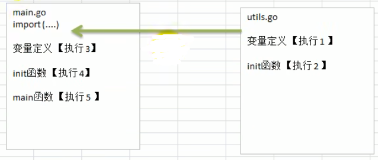

### 6.8 匿名函数

Go支持匿名函数，匿名函数就是没有名字的函数，如果我们某个函数只是希望使用一次，可以考 虑使用匿名函数，匿名函数也可以实现多次调用。

**匿名函数使用方式 1**

在定义匿名函数时就直接调用，这种方式匿名函数只能调用一次。

```go
package main
import (
	"fmt"
)
func main() {
	//在定义匿名函数时就直接调用，这种方式匿名函数只能调用一次
	//求两个数的和， 使用匿名函数的方式完成
	res1 := func (n1 int, n2 int) int {
		return n1 + n2
	}(10, 20)
	fmt.Println("res1=", res1)//res1= 30
}
```

**匿名函数使用方式 2**

将匿名函数赋给一个变量(函数变量)，再通过该变量来调用匿名函数

```go
package main
import (
	"fmt"
)

func main() {
	//将匿名函数func (n1 int, n2 int) int赋给 a变量
	//则a 的数据类型就是函数类型 ，此时,我们可以通过a完成调用
	a := func (n1 int, n2 int) int {
		return n1 - n2
	}
	res2 := a(10, 30)
	fmt.Println("res2=", res2)//res2= -20
	res3 := a(90, 30)
	fmt.Println("res3=", res3)//res3= 60
}
```

**全局匿名函数**

如果将匿名函数赋给一个全局变量，那么这个匿名函数，就成为一个全局匿名函数，可以在程序有效。

```go
package main
import (
	"fmt"
)

var (
	//fun1就是一个全局匿名函数
	Fun1 = func (n1 int, n2 int) int {
		return n1 * n2
	}
)

func main() {
	//全局匿名函数的使用
	res4 := Fun1(4, 9)
	fmt.Println("res4=", res4)//res4= 36
}
```

### 6.9 闭包

基本介绍：闭包就是一个函数和与其相关的引用环境组合的一个整体(实体)

**闭包让你可以在一个内层函数中访问到其外层函数的作用域。**

可简单理解为：**有权访问另一个函数作用域内变量的函数都是闭包。**

```go
package main
import (
	"fmt"
)

//累加器,AddUpper 是一个函数，返回的数据类型是 fun(int)int
func AddUpper() func (int) int {
    //返回的是一个匿名函数, 但是这个匿名函数引用到函数外的n,因此这个匿名函数就和n形成一个整体，构成闭包。
	var n int = 10 
	return func (x int) int {
		n = n + x
		return n
	}
}

func main() {
	f := AddUpper()
	fmt.Println(f(1))// 11 
	fmt.Println(f(2))// 13
	fmt.Println(f(3))// 16

}
```

#### 6.9.1使用案例

闭包的好处，如果使用传统的方法，也可以轻松实现这个功能，但是传统方法需要每次都传入后缀名，比如 .jpg,而闭包因为可以保留上次引用的某个值，所以我们传入一次就可以反复使用。

以面向对象思想理解闭包，外部整体像一个类，先传入的.jpg 像设置类里的一个public属性，再向返回函数传参像调用类的成员函数，此时成员函数可以调用类里已设置的属性。

```go
package main
import (
	"fmt"
	"strings"
)

// 1)编写一个函数 makeSuffix(suffix string)  可以接收一个文件后缀名(比如.jpg)，并返回一个闭包
// 2)调用闭包，可以传入一个文件名，如果该文件名没有指定的后缀(比如.jpg) ,则返回 文件名.jpg , 如果已经有.jpg后缀，则返回原文件名。
// 3)使用闭包的方式完成
// 4)strings.HasSuffix , 该函数可以判断某个字符串是否有指定的后缀。

//返回的匿名函数和 makeSuffix(suffixstring) 的 suffix 变量 组合成一个闭包,因为 返回的函数引用到suffix这个变量
func makeSuffix(suffix string) func (string) string {
	return func (name string) string {
		//如果 name 没有指定后缀，则加上，否则就返回原来的名字
		if !strings.HasSuffix(name, suffix) {
			return name + suffix
		}
		return name
	}
}

func makeSuffix2(suffix string, name string)  string {
	//如果 name 没有指定后缀，则加上，否则就返回原来的名字
	if !strings.HasSuffix(name, suffix)  {
		return name + suffix
	}
	return name
}

func main() {
	//返回一个闭包
	f2 := makeSuffix(".jpg") //如果使用闭包完成，好处是只需要传入一次后缀。
	fmt.Println("文件名处理后=", f2("winter")) // winter.jgp
	fmt.Println("文件名处理后=", f2("bird.jpg")) // bird.jpg

	fmt.Println("文件名处理后=", makeSuffix2("jpg", "winter")) // winter.jgp
	fmt.Println("文件名处理后=", makeSuffix2("jpg", "bird.jpg")) // bird.jpg
}
```

#### 6.9.2 闭包经典使用场景
1、return一个内部函数，读取内部函数的变量

2、函数作为参数

3、IIFE（自执行函数）

5、使用回调函数就是在使用闭包

6、将外部函数创建的变量值始终保持在内存中；（会出现内存泄漏）

#### 6.9.3 使用闭包注意点
因为使用闭包会包含其他函数的作用域，会比其他函数占据更多的内存空间，不会在调用结束之后被垃圾回收机制（简称GC机制）回收，多度使用闭包会过度占用内存，造成内存泄漏。

#### 6.9.4 闭包相关面试题
1、简述什么是闭包，闭包的作用是什么？写出一个简单的闭包例子。

2、闭包会造成内存泄漏吗？

会，因为使用闭包会包含其他函数的作用域，会比其他函数占据更多的内存空间，不会在调用结束之后被垃圾回收机制回收，多度使用闭包会过度占用内存，造成内存泄漏。

3、for循环和闭包(必刷题)

### 6.10 defer

在函数中，程序员经常需要创建资源(比如：数据库连接、文件句柄、锁等) ，为了在**函数执行完毕后，及时的释放资源**，Go的设计者提供defer(延时机制)。defer 最主要的价值是在，当函数执行完毕后，可以及时的释放函数创建的资源。看下模拟代码。

```go
package main
import (
	"fmt"
)

func sum(n1 int, n2 int) int {
	//当执行到defer时，暂时不执行，会将defer后面的语句压入到独立的栈(defer栈)
	//当函数执行完毕后，再从defer栈，按照先入后出的方式出栈，执行
	defer fmt.Println("ok1 n1=", n1) //defer 3. ok1 n1 = 10
	defer fmt.Println("ok2 n2=", n2) //defer 2. ok2 n2= 20

	res := n1 + n2 // res = 30
	fmt.Println("ok3 res=", res) // 1. ok3 res= 30
	return res
}

func main() {
	res := sum(10, 20)
	fmt.Println("res=", res)  // 4. res= 30
}
//-------结果--------
ok3 res= 30
ok2 n2= 20
ok1 n1 = 10
res= 30
```

**注意事项**

1 ) 当go执行到一个defer时，不会立即执行defer后的语句，而是将defer 后的语句压入到一个栈中[我为了讲课方便，暂时称该栈为defer栈],然后继续执行函数下一个语句。

2 ) 当函数执行完毕后，在从defer栈中，依次从栈顶取出语句执行(注：遵守栈 先入后出的机制)，所以同学们看到前面案例输出的顺序。

3 ) 在defer 将语句放入到栈时，也会将相关的值拷贝同时入栈。

**defer使用**

1 ) 在golang编程中的通常做法是，创建资源后，比如(打开了文件，获取了数据库的链接，或者是锁资源)， 可以执行 defer file.Close() defer connect.Close()

2 ) 在defer后，可以继续使用创建资源.

3 ) 当函数完毕后，系统会依次从defer栈中，取出语句，关闭资源.

4 ) 这种机制，非常简洁，程序员不用再为在什么时机关闭资源而烦心。
### 6.11 函数传递方式
**传递方式分类**

1 ) 值传递

2 ) 引用传递

其实，不管是值传递还是引用传递，传递给函数的都是变量的副本，不同的是，值传递的是值的拷贝，引用传递的是地址的拷贝，一般来说，地址拷贝效率高，因为数据量小，而值拷贝决定拷贝的数据大小，数据越大，效率越低。

**值类型和引用类型**

1 ) 值类型：基本数据类型 int 系列，float 系列，bool，string ，数组和结构体struct

2 ) 引用类型：指针，slice切片，map，管道chan，interface 等都是引用类型

**特点**

1 ) 值类型默认是值传递:变量直接存储值，内存通常在**栈**中分配。

2 ) 引用类型默认是引用传递：变量存储的是一个地址，这个地址对应的空间才真正存储数据（值），内存通常在**堆**上分配，当没有任何变量引用这个地址时，改地址对应的数据空间就成为一个垃圾，由GC来回收。

3 ) 如果希望函数内的变量能修改函数外的变量，可以传入变量的地址&，函数内以指针的方式操作变量。从效果上看类似引用 。

### 6.12 变量作用域
1 ) 函数内部声明/定义的变量叫局部变量，作用域仅限于函数内部

2 ) 函数外部声明/定义的变量叫全局变量，作用域在整个包都有效，如果其首字母为大写，则作用域在整个程序有效

3 ) 如果变量是在一个代码块，比如 for/if中，那么这个变量的的作用域就在该代码块

### 6.13 字符串常用系统函数
1 ) 统计字符串的长度，按字节 len(str)

```go
func main(){
    //统计字符串的长度，按字节 len(str)
	////golang的编码统一为utf-8 (ascii的字符(字母和数字) 占一个字节，汉字占用3个字节)
	str := "hello北" 
	fmt.Println("str len=", len(str)) // 8
}
```

2 ) 字符串遍历，同时处理有中文的问题 r:=[]rune(str)
```go
func main(){
    str2 := "hello北京"
	//字符串遍历，同时处理有中文的问题 r := []rune(str)
	r := []rune(str2)
	for i := 0; i < len(r); i++ {
		fmt.Printf("字符=%c\n", r[i])
	}
}
```

3 ) 字符串转整数: n,err:=strconv.Atoi(" 12 ")
```go
func main(){
    //字符串转整数:	 n, err := strconv.Atoi("12")
	n, err := strconv.Atoi("123")
	if err != nil {
		fmt.Println("转换错误", err)
	}else {
		fmt.Println("转成的结果是", n)//转成的结果是 123
	}
}
```

4 ) 整数转字符串 str=strconv.Itoa( 12345 )
```go
func main(){
    //整数转字符串  str = strconv.Itoa(12345)
	str = strconv.Itoa(12345)
	fmt.Printf("str=%v, str=%T\n", str, str)//str=12345, str=string 
}
```

5 ) 字符串 转 []byte: varbytes=[]byte(“hello go”)
```go
func main(){
    //字符串 转 []byte:  var bytes = []byte("hello go")
	var bytes = []byte("hello go")
	fmt.Printf("bytes=%v\n", bytes)//bytes=[104 101 108 108 111 32 103 111]
}
```

6.) []byte 转 字符串:str=string([]byte{ 97 , 98 , 99 })
```go
func main(){
    //[]byte 转 字符串: str = string([]byte{97, 98, 99})
	str = string([]byte{97, 98, 99}) 
	fmt.Printf("str=%v\n", str)//str=abc
}
```
7 ) 10 进制转 2 , 8 , 16.进制: str=strconv.FormatInt( 123 , 2 )// 2 - > 8 , 16
```go
func main(){
    //10进制转 2, 8, 16进制:  str = strconv.FormatInt(123, 2),返回对应的字符串
	str = strconv.FormatInt(123, 2)
	fmt.Printf("123对应的二进制是=%v\n", str)//123对应的二进制是=1111011
	str = strconv.FormatInt(123, 16)
	fmt.Printf("123对应的16进制是=%v\n", str)//123对应的16进制是=7b
}
```
8 ) 查找子串是否在指定的字符串中:strings.Contains(“seafood”,“foo”)//true
```go
func main(){
    //查找子串是否在指定的字符串中: strings.Contains("seafood", "foo") //true
	b := strings.Contains("seafood", "mary")
	fmt.Printf("b=%v\n", b) //b=false
}
```
9 ) 统计一个字符串有几个指定的子串 ： strings.Count(“ceheese”,“e”)// 4
```go
func main(){
    //统计一个字符串有几个指定的子串 ： strings.Count("ceheese", "e") //4
	num := strings.Count("ceheese", "e")
	fmt.Printf("num=%v\n", num)//num=4
}
```
10 ) 不区分大小写的字符串比较(==是区分字母大小写的):fmt.Println(strings.EqualFold(“abc”,“Abc”))//true
```go
func main(){
    //不区分大小写的字符串比较(==是区分字母大小写的): fmt.Println(strings.EqualFold("abc", "Abc")) // true
	b = strings.EqualFold("abc", "Abc")
	fmt.Printf("b=%v\n", b) //true
	fmt.Println("结果","abc" == "Abc") // false //区分字母大小写
}
```
11 )返回子串在字符串第一次出现的index值，如果没有返回- 1 :strings.Index(“NLT_abc”,“abc”)// 4
```go
func main(){
    //返回子串在字符串第一次出现的index值，如果没有返回-1 : 
	//strings.Index("NLT_abc", "abc") // 4
	index := strings.Index("NLT_abcabcabc", "abc") // 4
	fmt.Printf("index=%v\n",index)
}
```
12 ) 返回子串在字符串最后一次出现的index，如没有返回- 1 :strings.LastIndex(“gogolang”,“go”)
```go
func main(){
    //返回子串在字符串最后一次出现的index，
	//如没有返回-1 : strings.LastIndex("go golang", "go")

	index = strings.LastIndex("go golang", "go") //3
	fmt.Printf("index=%v\n",index)

}
```
13 ) 将指定的子串替换成 另外一个子串:strings.Replace(“gogohello”,“go”,“go语言”,n)n可以指定你希望替换几个，如果n=- 1 表示全部替换
```go
func main(){
    //将指定的子串替换成 另外一个子串: strings.Replace("go go hello", "go", "go语言", n) 
	//n可以指定你希望替换几个，如果n=-1表示全部替换

	str2 = "go go hello"
	str = strings.Replace(str2, "go", "北京", -1)
	fmt.Printf("str=%v str2=%v\n", str, str2)//str=北京 北京 hello str2=go go hello
}
```
14 ) 按照指定的某个字符，为分割标识，将一个字符串拆分成字符串数组：strings.Split(“hello,wrold,ok”,“,”)
```go
func main(){
    //按照指定的某个字符，为分割标识，将一个字符串拆分成字符串数组： 
	//strings.Split("hello,wrold,ok", ",")
	strArr := strings.Split("hello,wrold,ok", ",")
	for i := 0; i < len(strArr); i++ {
		fmt.Printf("str[%v]=%v\n", i, strArr[i])
	} 
	fmt.Printf("strArr=%v\n", strArr)//strArr=[hello wrold ok] 
}
```
15 ) 将字符串的字母进行大小写的转换:strings.ToLower(“Go”)//gostrings.ToUpper(“Go”)//GO
```go
func main(){
    //将字符串的字母进行大小写的转换: 
	//strings.ToLower("Go") // go strings.ToUpper("Go") // GO

	str = "goLang Hello"
	str = strings.ToLower(str) 
	str = strings.ToUpper(str) 
	fmt.Printf("str=%v\n", str) //str=GOLANG HELLO
}
```
16.) 将字符串左右两边的空格去掉： strings.TrimSpace("tnalonegopherntrn ")
```go
func main(){
    //将字符串左右两边的空格去掉： strings.TrimSpace(" tn a lone gopher ntrn   ")
	str = strings.TrimSpace(" tn a lone gopher ntrn   ")
	fmt.Printf("str=%q\n", str)//str="tn a lone gopher ntrn"
}
```
17 ) 将字符串左右两边指定的字符去掉 ： strings.Trim(“!hello!”,“!”) //[“hello”]//将左右两边! 和 ""去掉

```go
func main(){
    //将字符串左右两边指定的字符去掉 ： 
	//strings.Trim("! hello! ", " !")  // ["hello"] //将左右两边 ! 和 " "去掉
	str = strings.Trim("! he!llo! ", " !")
	fmt.Printf("str=%q\n", str)//str="he!llo"
}
```
18 ) 将字符串左边指定的字符去掉 ： strings.TrimLeft(“!hello!”,“!”) //[“hello”]//将左边! 和 " "去掉

```go
func main(){
    str = strings.TrimLeft("! he!llo! ", " !")
	fmt.Printf("str=%q\n", str)//str="he!llo! "
}
```
19 ) 将字符串右边指定的字符去掉 ：strings.TrimRight(“!hello!”,“!”) //[“hello”]//将右边! 和 " "去掉

```go
func main(){
    str = strings.TrimRight("! he!llo! ", " !")
	fmt.Printf("str=%q\n", str)//str="! he!llo"
}
```
20 ) 判断字符串是否以指定的字符串开头:strings.HasPrefix("ftp:// 192. 168. 10. 1 ",“ftp”)//true
```go
func main(){
    //判断字符串是否以指定的字符串开头: 
	b = strings.HasPrefix("ftp://192.168.10.1", "hsp") 
	fmt.Printf("b=%v\n", b)//b=false
}
```

21 ) 判断字符串是否以指定的字符串结束:strings.HasSuffix(“NLT_abc.jpg”,“abc”)//false

```go
func main(){
    //判断字符串是否以指定的字符串结束
    b = strings.HasSuffix("ftp://192.168.10.1", "10.1") //true
	fmt.Printf("b=%v\n", b)
}
```

### 6.14 时间和日期相关函数
1 ) 时间和日期相关函数，需要导入 time包

2 ) time.Time 类型，用于表示时间

```go
package main

import (
	"fmt"
	"time"
)

func main() {
	//看看日期和时间相关函数和方法使用
	//获取当前时间
	now := time.Now()
	fmt.Printf("now=%v now type=%T\n", now, now)
    //now=2022-12-29 10:55:38.068575 +0800 CST m=+0.012695601 now type=time.Time
}
```

3 ) 如何获取到部分的日期信息

```go
package main
import (
	"fmt"
	"time"
)
func main() {
	//看看日期和时间相关函数和方法使用
	//1. 获取当前时间
	now := time.Now()
	fmt.Printf("now=%v now type=%T\n", now, now)
    //now=2022-12-29 10:55:38.068575 +0800 CST m=+0.012695601 now type=time.Time

	//2.通过now可以获取到年月日，时分秒
	fmt.Printf("年=%v\n", now.Year())//年=2022
	fmt.Printf("月=%v\n", now.Month())//月=December
	fmt.Printf("月=%v\n", int(now.Month()))//月=12
	fmt.Printf("日=%v\n", now.Day())//日=29
	fmt.Printf("时=%v\n", now.Hour())//时=10
	fmt.Printf("分=%v\n", now.Minute())//分=55
	fmt.Printf("秒=%v\n", now.Second())//秒=38
}
```

4 ) 格式化日期时间

方式 1 : 就是使用Printf 或者 SPrintf

```go
package main
import (
	"fmt"
	"time"
)

func main() {
    now := time.Now()
	//格式化日期时间    
	fmt.Printf("当前年月日 %d-%d-%d %d:%d:%d \n", now.Year(), 
	now.Month(), now.Day(), now.Hour(), now.Minute(), now.Second())//当前年月日 2022-12-29 10:55:38

    //fmt.Sprintf 来格式化字符串
	dateStr := fmt.Sprintf("当前年月日 %d-%d-%d %d:%d:%d \n", now.Year(), 
	now.Month(), now.Day(), now.Hour(), now.Minute(), now.Second())//

	fmt.Printf("dateStr=%v\n", dateStr)//dateStr=当前年月日 2022-12-29 10:55:38
}
```

方式二: 使用 time.Format() 方法完成:

```go
package main
import (
	"fmt"
	"time"
)

func main() {
    now := time.Now()
	//格式化日期时间的第二种方式
	fmt.Printf(now.Format("2006-01-02 15:04:05"))//2022-12-29 10:55:38
	fmt.Println()
	fmt.Printf(now.Format("2006-01-02"))//2022-12-29
	fmt.Println()
	fmt.Printf(now.Format("15:04:05"))//10:55:38
	fmt.Println()
	fmt.Printf(now.Format("2006"))//2022
	fmt.Println()
}
```

5 ) 时间的常量

```go
const(
     Nanosecond Duration= 1 //纳秒
     Microsecond = 1000 *Nanosecond //微秒
     Millisecond = 1000 *Microsecond//毫秒
     Second = 1000 *Millisecond//秒
     Minute = 60 *Second//分钟
     Hour = 60 *Minute//小时
)
```

常量的作用:**在程序中可用于获取指定时间单位的时间，比如想得到 100 毫秒**

```go
100 *time.Millisecond
```

6 ) 使用Sleep测量时间

```go
package main

import (
	"fmt"
	"time"
)

func main() {
	i := 0
	for {
		i++
		fmt.Println(i)
		//休眠
		//time.Sleep(time.Second)//每隔1秒中打印一个数字，打印到100时就退出
		time.Sleep(time.Millisecond * 100)//每隔0.1秒中打印一个数字，打印到100时就退出
		if i == 100 {
			break
		}
	}
}
```

7 ) time的Unix和UnixNano的方法

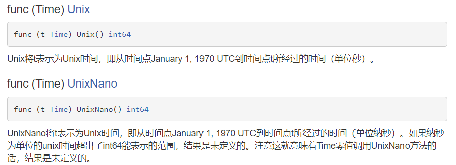

```go
package main
import (
	"fmt"
	"time"
)

func main() {
	// 获取当前时间
	now := time.Now()
	//Unix和UnixNano的使用
	fmt.Printf("unix时间戳=%v unixnano时间戳=%v\n", now.Unix(), now.UnixNano())
    //unix时间戳=1672282538 unixnano时间戳=1672282538068575000
}
```

可以用来统计时间

```go
package main
import (
	"fmt"
	"time"
	"strconv"
)

func test() {
	str := ""
	for i := 0; i < 100000; i++ {
		str += "hello" + strconv.Itoa(i)
	}
}

func main() {
	//在执行test前，先获取到当前的unix时间戳
	start := time.Now().Unix()
	test()
	end := time.Now().Unix()
	fmt.Printf("执行test()耗费时间为%v秒\n", end-start)//执行test()耗费时间为7秒
}
```

### 6.15 系统函数(内置函数builtin)

1 ) len：用来求长度，比如string、array、slice、map、channel

2 ) new：用来分配内存，主要用来分配值类型，比如int、float 32 ,struct返回的是指针

```go
package main
import (
	"fmt"
)

func main() {
	num1 := 100
	fmt.Printf("num1的类型%T , num1的值=%v , num1的地址%v\n", num1, num1, &num1)
    //num1的类型int , num1的值=100 , num1的地址0xc0000140c8
    
	num2 := new(int) // *int
	//num2的值 = 地址 0xc000014100 （这个地址是系统分配）
	//num2的地址%v = 地址 0xc000006030  (这个地址是系统分配)
	*num2  = 100
	fmt.Printf("num2的类型%T , num2的值=%v , num2的地址%v\n num2这个指针，指向的值=%v", 
		num2, num2, &num2, *num2)
    //num2的类型*int , num2的值=0xc000014100 , num2的地址0xc000006030  num2这个指针，指向的值=100
}
```

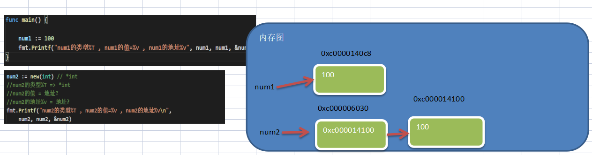

3 ) make：用来分配内存，主要用来分配引用类型，比如channel、map、slice。

### 6.16 错误处理

```go
package main

import (
	"fmt"
)

func test() {
	num1 := 10
	num2 := 0
	res := num1 / num2
	fmt.Println("res=", res)
}

func main() {
	test()
	fmt.Println("main()下面的代码...")
}
//结果
//panic: runtime error: integer divide by zero
```

1 ) 在默认情况下，当发生错误后(panic)，程序就会退出（崩溃）

2 ) 如果我们希望：当发生错误后，可以捕获到错误，并进行处理，保证程序可以继续执行。还可以在捕获到错误后，给管理员一个提示(邮件,短信。。。）

**基本说明**

1 ) Go语言追求简洁优雅，所以，Go语言不支持传统的 `try-catch-finally` 这种处理。

2 ) Go中引入的处理方式为： defer , panic , recover

3 ) 这几个异常的使用场景可以这么简单描述：Go中可以抛出一个panic的异常，然后在defer中通过**recover捕获这个异常**，然后正常处理

```go
package main
import (
	"fmt"
	"time"
)

func test() {
	//使用defer + recover 来捕获和处理异常
	defer func() {
		err := recover()  // recover()内置函数，可以捕获到异常
		if err != nil {  // 说明捕获到错误
			fmt.Println("err=", err)
		}
	}()
	num1 := 10
	num2 := 0
	res := num1 / num2
	fmt.Println("res=", res)
}

func main() {
	test()
	for {
		fmt.Println("main()下面的代码...")
		time.Sleep(time.Second)
	}
}
/*结果
err= runtime error: integer divide by zero
发送邮件给admin@sohu.com~
main()下面的代码...
*/
```

**自定义错误**

Go程序中，也支持自定义错误， 使用errors.New 和 panic 内置函数。

1 ) errors.New(“错误说明”), 会返回一个error类型的值，表示一个错误

2 ) panic内置函数 ,接收一个interface{}类型的值（也就是任何值了）作为参数。可以接收error类型的变量，输出错误信息，并退出程序.

```go
package main
import (
	"fmt"
	_ "time"
	"errors"
)
//函数去读取以配置文件init.conf的信息
//如果文件名传入不正确，我们就返回一个自定义的错误
func readConf(name string) (err error) {
	if name == "config.ini" {
		//读取...
		return nil
	} else {
		//返回一个自定义错误
		return errors.New("读取文件错误..")
	}
}

func test02() {
	err := readConf("config2.ini")
	if err != nil {
		//如果读取文件发送错误，就输出这个错误，并终止程序
		panic(err)
	}
	fmt.Println("test02()继续执行....")
}
	
func main() {
	test02()
	fmt.Println("main()下面的代码...")
}
//--------------------------------
//正确输出
test02()继续执行....
main()下面的代码...

//错误输出
panic: 读取文件错误..                                             
                                                                  
goroutine 1 [running]:                                            
main.test02()                                                     
        E:/goprojects/src/go_code/chapter06/error/main.go:42 +0x49
main.main()                                                       
        E:/goprojects/src/go_code/chapter06/error/main.go:58 +0x19

```


## 七、数组与切片

数组可以存放多个同一类型数据。数组也是一种数据类型，在Go中，数组是值类型。

### 7.1 数组的定义

```go
var 数组名 [数组大小]数据类型
var a [5]int// 数组名 [长度]数据类型
赋初值 a[0]= 1 a[1]= 30 
```

### 7.2 数组内存布局,地址连续

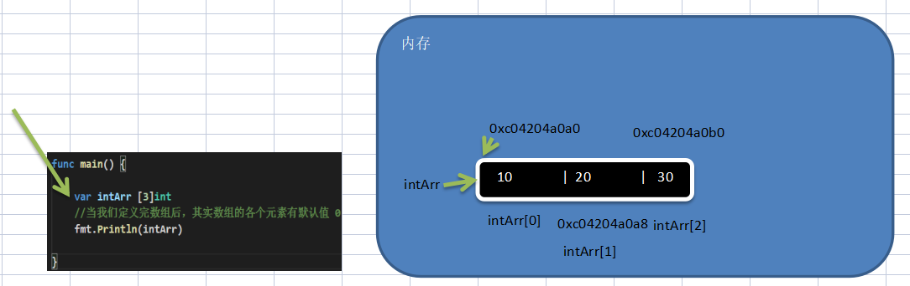

1 ) 数组的地址可以通过数组名来获取 &intArr

2 ) 数组的第一个元素的地址，就是数组的首地址

3 ) 数组的各个元素的地址间隔是依据数组的类型决定，比如int 64 - > 8， int 32 - > 4

### 7.3 初始化数组的方式

```go
package main
import (
	"fmt"
)

func main() {
	//初始化数组的方式
	var numArr01 [3]int = [3]int{1, 2, 3}
	fmt.Println("numArr01=", numArr01)

	var numArr02 = [3]int{5, 6, 7}
	fmt.Println("numArr02=", numArr02)
    
	//这里的 [...] 是规定的写法由go推导数组大小
	var numArr03 = [...]int{8, 9, 10}
	fmt.Println("numArr03=", numArr03)

	var numArr04 = [...]int{1: 800, 0: 900, 2:999}
	fmt.Println("numArr04=", numArr04)//numArr04= [900 800 999]
    
    f := [...] int{0: 1, 4: 1, 9: 1} // [1 0 0 0 1 0 0 0 0 1]
  	fmt.Println(f)

    e := [5] int{4: 100} // [0 0 0 0 100]
    fmt.Println(e)
    
    //类型推导:=
	strArr05 := [...]string{1: "tom", 0: "jack", 2:"mary"}
	fmt.Println("strArr05=", strArr05)//strArr05= [jack tom mary]
}
```

### 7.4 数组遍历

1）方式1：for（；；；）遍历数组

```go
package main

import (
	"fmt"
)

func main() {
	//for-range遍历数组
	heroes := [...]string{"宋江", "吴用", "卢俊义"}

	for i := 0; i < len(heroes); i++ {
		fmt.Printf("i=%v v=%v\n", i, heroes[i]) //i=0 v=宋江
	}
}
```

2）方式2：for-range结构遍历

```go
package main

import (
	"fmt"
)

func main() {
	//for-range遍历数组
	heroes := [...]string{"宋江", "吴用", "卢俊义"}

	for i, v := range heroes {//index和value的名称不是固定的。可以自己改变
		fmt.Printf("i=%v v=%v\n", i, v) //i=0 v=宋江
		fmt.Printf("heroes[%d]=%v\n", i, heroes[i])  //heroes[0]=宋江
	}

	for _, v := range heroes { 
		fmt.Printf("元素的值=%v\n", v) //元素的值=宋江
	}
}
```

### 7.5 数组使用注意事项
1 ) 数组是多个相同类型数据的组合，一个数组一旦声明/定义了，其长度是固定的，不能动态变化。否则报越界

2 ) 数组中的元素可以是任何数据类型，包括值类型和引用类型，但是不能混用。

3 ) 数组创建后，如果没有赋值，有默认值(零值)

- 数值类型数组：默认值为 0
- 字符串数组： 默认值为 “”
- bool数组： 默认值为 false

5 ) 使用数组的步骤:

- 1.声明数组并开辟空间 
- 2.给数组各个元素赋值(默认零值) 
- 3.使用数组

6 ) Go的数组属值类型，在默认情况下是值传递，因此会进行值拷贝。数组间不会相互影响

7 ) 如想在其它函数中，去修改原来的数组，可以使用引用传递(指针方式)

```go
package main
import (
	"fmt"
)

//函数
func test02(arr *[3]int) {
	fmt.Printf("arr指针的地址=%p", &arr)//arr指针的地址=0xc000006030
	(*arr)[0] = 88 //!!
} 


func main() {	
	arr := [3]int{11, 22, 33}
	fmt.Printf("arr 的地址=%p", &arr)//arr 的地址=0xc00000c150
	test02(&arr)
	fmt.Println("main arr=", arr)//arr= [88 22 33]
}	
```

8 ) 长度是数组类型的一部分，在传递函数参数时需要考虑数组的长度

```go
/题1
package main
import (
	"fmt"
)

//默认值拷贝
func modify(arr []int) {
	arr[0] = 100
    fmt.Println("modify的arr",arr)
} 

func main() {	
	var arr = [...]int{1,2,3}
	modify(arr)
}	
//编译错误，因为不能把[3]int 传递给[]int
```

```go
//题2
package main
import (
	"fmt"
)

//默认值拷贝
func modify(arr [4]int) {
	arr[0] = 100
    fmt.Println("modify的arr",arr)
} 

func main() {	
	var arr = [...]int{1,2,3}
	modify(arr)
}	
//编译错误，因为不能把[3]int 传递给[4]int
```

### 7.6 切片的定义
1 ) 切片的英文是slice

2 ) 切片是数组的一个引用，因此切片是**引用类型**，在进行传递时，遵守引用传递的机制。

3 ) 切片的**使用和数组类似**，遍历切片、访问切片的元素和求切片长度len(slice)都一样。

4 ) 切片的长度是可以变化的，因此切片是一个可以**动态变化数组**。

5 ) 切片定义的基本语法:

```go
var 切片名 []类型
//比如：vara[]int
```

```go
package main
import (
	"fmt"
)

func main() {
	//演示切片的基本使用
	var intArr [5]int = [...]int{1, 22, 33, 66, 99}
	//声明/定义一个切片
	//1. slice 就是切片名
	//2. intArr[1:3] 表示 slice 引用到intArr这个数组 
	//3. 引用intArr数组的起始下标为 1 , 最后的下标为3(但是不包含3)    
	slice := intArr[1:3] 
	fmt.Println("intArr=", intArr) //[1 22 33 66 99]
	fmt.Println("slice 的元素是 =", slice) //  22, 33
	fmt.Println("slice 的元素个数 =", len(slice)) // 2
	fmt.Println("slice 的容量 =", cap(slice)) //4 切片的容量是可以动态变化  
}
```

### 7.7 切片的内存形式

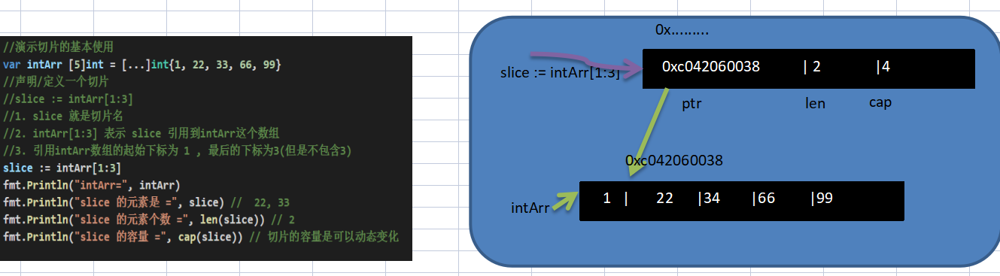

1 .slice的确是一个引用类型

2 .slice 从底层来说，其实就是一个数据结构(struct结构体)

```go
type slice struct{
 ptr *[2]int
 len int
 cap int
}
```


### 7.8 切片的使用

- 第1种方式：定义一个切片，然后让切片去引用一个已经创建好的数组，比如前面就是这样的。

- 第2种方式：通过 make 来创建切片.

基本语法：

```go
var 切片名 []type = make([]type,len,[cap])
```

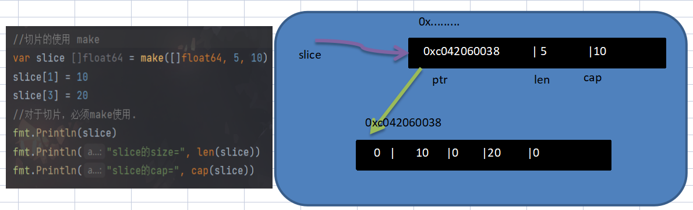

- 第3种方式：定义一个切片，直接就指定具体数组，使用原理类似make的方式

```go
package main

import (
	"fmt"
)

func main() {
	var slice []float64 = make([]float64, 5, 10)
	slice[1] = 10
	slice[3] = 20
	fmt.Println(slice)//[0 10 0 20 0]
	fmt.Println("slice的size=", len(slice))//slice的size= 5
	fmt.Println("slice的cap=", cap(slice))//slice的size= 10
    
	//第3种方式：定义一个切片，直接就指定具体数组，使用原理类似make的方式
	var strSlice []string = []string{"tom", "jack", "mary"}
	fmt.Println("strSlice=", strSlice)//strSlice= [tom jack mary]
	fmt.Println("strSlice size=", len(strSlice)) //strSlice size= 3
	fmt.Println("strSlice cap=", cap(strSlice)) //strSlice cap= 3
}
```

方式 1 和方式 2 的**区别**:

方式1是直接引用数组，这个数组是事先存在的，程序员是可见的

方式2是通过make来创建切片，make也会创建一个数组，是由切片在底层进行维护，程序员是看不见的。


### 7.9 切片使用注意事项

1）从数组引用切片规则左闭合右开，即

切片初始化时 `varslice = arr[startIndex:endIndex]`

从arr数组下标为`startIndex`，取到 下标为`endIndex`的元素(不含`arr[endIndex]`)。

2 ) 切片定义完后，还不能使用，因为本身是一个空的，需要让其引用到一个数组，或者make一个空间供切片来使用

3 ) 切片可以继续切片

4 ) 用append内置函数，可以对切片进行动态追加

```go
package main
import (
	"fmt"
)

func main() {
	//使用常规的for循环遍历切片
	var arr [5]int = [...]int{10, 20, 30, 40, 50}
	//slice := arr[1:4] // 20, 30, 40
	slice := arr[1:4]
	for i := 0; i < len(slice); i++ {
		fmt.Printf("slice[%v]=%v ", i, slice[i])//slice[0]=20 slice[1]=30 slice[2]=40 
	}

	fmt.Println()
	//使用for--range 方式遍历切片
	for i, v := range slice {
		fmt.Printf("i=%v v=%v \n", i, v)//i=0 v=20 
	}

	slice2 := slice[1:2] //  slice [ 20, 30, 40]    [30]
	slice2[0] = 100  // 因为arr , slice 和slice2 指向的数据空间是同一个，因此slice2[0]=100，其它的都变化

	fmt.Println("slice2=", slice2)//slice2= [100]
	fmt.Println("slice=", slice)//slice= [20 100 40]
	fmt.Println("arr=", arr)//arr= [10 20 100 40 50] 

	fmt.Println()

	//用append内置函数，可以对切片进行动态追加
	var slice3 []int = []int{100, 200, 300}
	//通过append直接给slice3追加具体的元素
	slice3 = append(slice3, 400, 500, 600)
	fmt.Println("slice3", slice3) //slice3 [100 200 300 400 500 600] 

	//通过append将切片slice3追加给slice3
	slice3 = append(slice3, slice3...) // slice3 [100 200 300 400 500 600 100 200 300 400 500 600]
	fmt.Println("slice3", slice3)
}
```

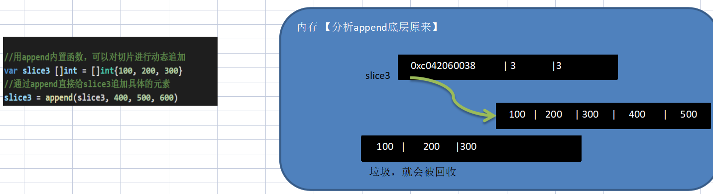

切片 append 操作的底层原理分析:

- 切片append操作的本质就是对数组扩容
- go底层会创建一下新的数组newArr(安装扩容后大小)
- 将slice原来包含的元素拷贝到新的数组newArr
- slice 重新引用到newArr
- 注意newArr是在底层来维护的，程序员不可见.

5）切片的拷贝操作

切片使用copy内置函数完成拷贝

```go
package main
import (
	"fmt"
)

func main() {
	//切片的拷贝操作 copy(para 1 ,para 2) 参数的数据类型是切片
	//切片使用copy内置函数完成拷贝，举例说明
	fmt.Println()
	var slice4 []int = []int{1, 2, 3, 4, 5}
	var slice5 = make([]int, 10)
	copy(slice5, slice4)
    //slice 4 和slice 5 的数据空间是独立，相互不影响，也就是说slice4[0]= 999 ,slice5[0]仍然是1，所以是值复制
	fmt.Println("slice4=", slice4)//slice4= [1 2 3 4 5] 
	fmt.Println("slice5=", slice5) //slice5= [1 2 3 4 5 0 0 0 0 0] 
}
```


### 7.10 string和slice


## 八、排序与查找


## 九、map

### 9.1 map概述
- map是key-value数据结构，又称为字段或者关联数组。类似其它编程语言的集合，在编程中是经常使用到

- 基本语法

> var map 变量名 map[keytype]valuetype

- golang中的map的 key 可以是很多种类型，比如 bool, 数字，string，指针，channel，还可以是只包含前面几个类型的接口，结构体， 数组。通常 key 为 int，string。**注意:**slice，map还有function不可以，因为这几个没法用 ==来判断

- valuetype的类型和key基本一样。通常为: 数字(整数，浮点数)，string，map，struct

### 9.2 map声明
map声明：

```go
var a map[string]string
var a map[string]int
var a map[int]string
var a map[string]map[string]string
```

**声明是不会分配内存的，初始化需要make ，分配内存后才能赋值和使用。**

```go
package main
import (
	"fmt"
)

func main() {
	//map的声明和注意事项 
	var a map[string]string
	//在使用map前，需要先make , make的作用就是给map分配数据空间
	a = make(map[string]string, 10)
	a["no1"] = "宋江" 
	a["no2"] = "吴用" 
	a["no1"] = "武松" 
	a["no3"] = "吴用" 
	fmt.Println(a)//map[no1:武松 no2:吴用 no3:吴用]
}
```

1 ) map在使用前一定要make

2 ) map的key是不能重复，如果重复了，则以最后这个key-value为准

3 ) map的value是可以相同的.

4 ) map的 key-value是无序

5 ) make内置函数数目

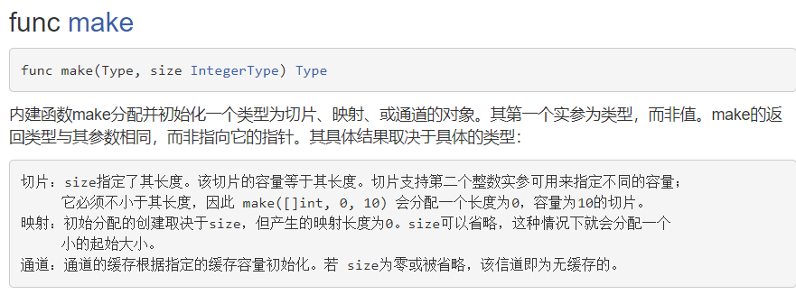

## 9.3 map的使用

方式 1

```go
package main
import (
	"fmt"
)

func main() {
	//第一种使用方式
	var a map[string]string
	//在使用map前，需要先make , make的作用就是给map分配数据空间
	a = make(map[string]string, 10)
	a["no1"] = "宋江" //ok?
	a["no2"] = "吴用" //ok?
	a["no1"] = "武松" //ok?
	a["no3"] = "吴用" //ok?
	fmt.Println(a)

}
```

方式 2

```go
package main
import (
	"fmt"
)

func main() {
	//第二种方式
	cities := make(map[string]string)
	cities["no1"] = "北京"
	cities["no2"] = "天津"
	cities["no3"] = "上海"
	fmt.Println(cities)
}
```

方式 3

```go
package main
import (
	"fmt"
)

func main() {
	//第三种方式
	heroes := map[string]string{
		"hero1" : "宋江",
		"hero2" : "卢俊义",
		"hero3" : "吴用",
	}
	heroes["hero4"] = "林冲"
	fmt.Println("heroes=", heroes)
}
```

9.4 map操作

- map增改

  ```go
  map[“key”]=value//如果 key 还没有，就是增加，如果 key 存在就是修改。
  ```

- map删除：
  说明：delete(map，“key”) ，delete是一个内置函数，如果key存在，就删除该key-value,如果key不存在，不操作，但是也不会报错

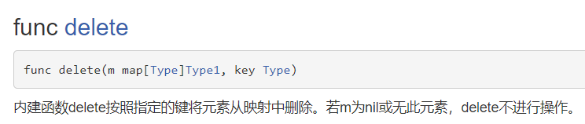


```go
package main
import (
	"fmt"
)

func main() {
	//第二种方式
	cities := make(map[string]string)
	cities["no1"] = "北京"
	cities["no2"] = "天津"
	cities["no3"] = "上海"
	fmt.Println(cities) // map[no1:北京 no2:天津 no3:上海]

	//删除
	delete(cities, "no1")
	fmt.Println(cities) // map[no2:天津 no3:上海]
	//当delete指定的key不存在时，删除不会操作，也不会报错
	delete(cities, "no4") 
	fmt.Println(cities) // map[no2:天津 no3:上海]
}	
```

如果我们要删除map的**所有key**,没有一个专门的方法一次删除，可以遍历一下key，逐个删除或者 **map=make(…)，make一个新的，让原来的成为垃圾，被gc回收**

```go
package main
import (
	"fmt"
)

func main() {
	//第二种方式
	cities := make(map[string]string)
	cities["no1"] = "北京"
	cities["no2"] = "天津"
	cities["no3"] = "上海"
	fmt.Println(cities)

	//如果希望一次性删除所有的key
	//1. 遍历所有的key,如何逐一删除 [遍历]
	//2. 直接make一个新的空间
	cities = make(map[string]string)
	fmt.Println(cities)
}

```

- map 查找

```go
package main
import (
	"fmt"
)

func main() {
	//第二种方式
	cities := make(map[string]string)
	cities["no1"] = "北京"
	cities["no2"] = "天津"
	cities["no3"] = "上海"
	fmt.Println(cities)

	//演示map的查找
	val, ok := cities["no2"]
	if ok {
		fmt.Printf("有no1 key 值为%v\n", val)//有no1 key 值为天津
	} else {
		fmt.Printf("没有no1 key\n")
	}
}
```

- map遍历

map的遍历使用 **for-range** 的结构遍历

map的长度：len()

```go
package main
import (
	"fmt"
)

func main() {
	//使用for-range遍历map
	//第二种方式
	cities := make(map[string]string)
	cities["no1"] = "北京"
	cities["no2"] = "天津"
	cities["no3"] = "上海"
	
	for k, v := range cities {
		fmt.Printf("k=%v v=%v\n", k, v)  //k=no1 v=北京
	}

	fmt.Println("cities 有", len(cities), " 对 key-value") //cities 有 3  对 key-value

	//使用for-range遍历一个结构比较复杂的map
	studentmap := make(map[string]map[string]string)
	
	studentmap["stu01"] =  make(map[string]string, 3)
	studentmap["stu01"]["name"] = "tom"
	studentmap["stu01"]["sex"] = "男"
	studentmap["stu01"]["address"] = "北京长安街~"

	studentmap["stu02"] =  make(map[string]string, 3) //这句话不能少!!
	studentmap["stu02"]["name"] = "mary"
	studentmap["stu02"]["sex"] = "女"
	studentmap["stu02"]["address"] = "上海黄浦江~"

    /*
    k1= stu01                         
         k2=name v2=tom           
         k2=sex v2=男             
         k2=address v2=北京长安街~

    */
	for k1, v1 := range studentmap {
		fmt.Println("k1=", k1)
		for k2, v2 := range v1 {
				fmt.Printf("\t k2=%v v2=%v\n", k2, v2)
		}
		fmt.Println()
	}
}
```


## 十、面向对象编程

### 10.1 go面向对象编程说明
1 ) Golang也支持面向对象编程(OOP)，但是和传统的面向对象编程有区别，并不是纯粹的面向对象语言。所以我们说Golang支持面向对象编程特性是比较准确的。

2 ) Golang没有类(class)，Go语言的结构体(struct)和其它编程语言的类(class)有同等的地位，你可以理解Golang是基于struct来实现OOP特性的。

3 ) Golang面向对象编程非常简洁，去掉了传统OOP语言的继承、方法重载、构造函数和析构函数、隐藏的this指针等等

4 ) Golang仍然有面向对象编程的继承，封装和多态的特性，只是实现的方式和其它OOP语言不一样，比如继承 ：Golang没有extends 关键字，继承是通过匿名字段来实现。

5 ) Golang面向对象(OOP)很优雅，OOP本身就是语言类型系统(typesystem)的一部分，通过接口(interface)关联，耦合性低，也非常灵活。也就是说在Golang中面向接口编程是非常重要的特性。

代码演示

```go
package main
import (
	"fmt"
)
// 张老太养了20只猫猫:一只名字叫小白,今年3岁,白色。还有一只叫小花,
// 今年100岁,花色。请编写一个程序，当用户输入小猫的名字时，就显示该猫的名字，
// 年龄，颜色。如果用户输入的小猫名错误，则显示 张老太没有这只猫猫。

//定义一个Cat结构体，将Cat的各个字段/属性信息，放入到Cat结构体进行管理
type Cat struct {
	Name string 
	Age int 
	Color string 
	Hobby string
	Scores [3]int // 字段是数组...
}

func main() {
	// 创建一个Cat的变量
	var cat1 Cat  // var a int
	fmt.Printf("cat1的地址=%p\n", &cat1) //cat1的地址=0xc000058050
	cat1.Name = "小白"
	cat1.Age = 3
	cat1.Color = "白色"
	cat1.Hobby = "吃<・)))><<"
	
	fmt.Println("cat1=", cat1)//cat1= {小白 3 白色 吃<・)))><< [0 0 0]}
	fmt.Println("猫猫的信息如下：")
	fmt.Println("name=", cat1.Name)//name= 小白
	fmt.Println("Age=", cat1.Age)//Age= 3
	fmt.Println("color=", cat1.Color)//color= 白色
	fmt.Println("hobby=", cat1.Hobby)//hobby= 吃<・)))><<
}
```

### 10.2 结构体在内存里的布局

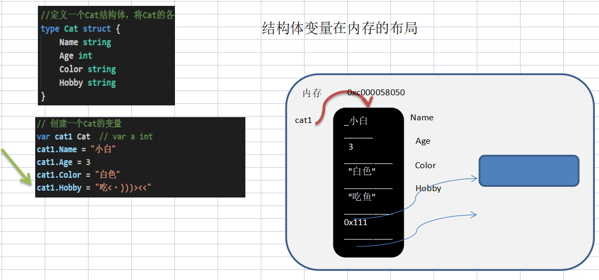

- 基本语法

```go
type 结构体名称 struct {
    field 1 type
    field 2 type
}
```

- 举例:

```go
type Student struct{
    Namestring//字段
    Ageint//字段
    Scorefloat 32
}
```

不同结构体变量的字段是独立，互不影响，一个结构体变量字段的更改，不影响另外一个, 结构体是**值类型**。

```go
package main
import (
	"fmt"
)

type Monster struct{
	Name string
	Age int
}

func main() {
	//不同结构体变量的字段是独立，互不影响，一个结构体变量字段的更改，
	//不影响另外一个, 结构体是值类型
	var monster1 Monster
	monster1.Name = "牛魔王"
	monster1.Age = 500

	monster2 := monster1 //结构体是值类型，默认为值拷贝
	monster2.Name = "青牛精"

	fmt.Println("monster1=", monster1) //monster1= {牛魔王 500}
	fmt.Println("monster2=", monster2) //monster2= {青牛精 500}
}
```

### 10.3 创建结构体变量和访问字段

- 方式 1 - 直接声明

```go
var person Person
```

- 方式 2 - {}

  var person Person = Person{}

```go
package main
import (
	"fmt"
)

type Person struct{
	Name string
	Age int
}
func main() {
	//方式2
	p2 := Person{"mary", 20}
	// p2.Name = "tom"
	// p2.Age = 18
	fmt.Println(p2)//{mary 20}
}
```

- 方式 3 - &

```go
package main
import (
	"fmt"
)
type Person struct{
	Name string
	Age int
}
func main() {
	//var person *Person = new (Person)

	var p3 *Person= new(Person)
	//因为p3是一个指针，因此标准的给字段赋值方式
	//(*p3).Name = "smith" 也可以这样写 p3.Name = "smith"
	//原因: go的设计者 为了程序员使用方便，底层会对 p3.Name = "smith" 进行处理
	//会给 p3 加上 取值运算 (*p3).Name = "smith"
	(*p3).Name = "smith" 
	p3.Name = "john" //

	(*p3).Age = 30
	p3.Age = 100
	fmt.Println(*p3)//{john 100}
}
```

- 方式 4 - {}

```go
package main
import (
	"fmt"
)

type Person struct{
	Name string
	Age int
}
func main() {
	//var person *Person = &Person{}

	//下面的语句，也可以直接给字符赋值
	//var person *Person = &Person{"mary", 60} 
	var person *Person = &Person{}

	//因为person 是一个指针，因此标准的访问字段的方法
	// (*person).Name = "scott"
	// go的设计者为了程序员使用方便，也可以 person.Name = "scott"
	// 原因和上面一样，底层会对 person.Name = "scott" 进行处理， 会加上 (*person)
	(*person).Name = "scott"
	person.Name = "scott~~"

	(*person).Age = 88
	person.Age = 10
	fmt.Println(*person)//{scott~~ 10}
}
```

说明:
1 ) 第 3 种和第 4 种方式返回的是 结构体指针。

2 ) 结构体指针访问字段的标准方式应该是：`(* 结构体指针).字段名` ，比如

```go
(*person).Name="tom"
```

3 ) 但go做了一个简化，也支持`结构体指针. 字段名`, 比如 person.Name=“tom”。更加符合程序员使用的习惯， go 编译器底层 对 person.Name 做了转化 `(*person).Name`

### 10.4 结构体细节

1 ) 结构体的所有字段在**内存中是连续**的

```go
package main 
import "fmt"

//结构体
type Point struct {
	x int
	y int
}

//结构体
type Rect struct {
	leftUp, rightDown Point
}

//结构体
type Rect2 struct {
	leftUp, rightDown *Point
}

func main() {
	r1 := Rect{Point{1,2}, Point{3,4}} 

	//r1有四个int, 在内存中是连续分布
	//打印地址
	fmt.Printf("r1.leftUp.x 地址=%p r1.leftUp.y 地址=%p r1.rightDown.x 地址=%p r1.rightDown.y 地址=%p \n", 
	&r1.leftUp.x, &r1.leftUp.y, &r1.rightDown.x, &r1.rightDown.y)
	//r1.leftUp.x 地址=0xc0000101e0 r1.leftUp.y 地址=0xc0000101e8 
    //r1.rightDown.x 地址=0xc0000101f0 r1.rightDown.y 地址=0xc0000101f8
    
	//r2有两个 *Point类型，这个两个*Point类型的本身地址也是连续的，
	//但是他们指向的地址不一定是连续

	r2 := Rect2{&Point{10,20}, &Point{30,40}} 

	//打印地址
	fmt.Printf("r2.leftUp 本身地址=%p r2.rightDown 本身地址=%p \n", &r2.leftUp, &r2.rightDown)
    //r2.leftUp 本身地址=0xc00004a250 r2.rightDown 本身地址=0xc00004a258

	//他们指向的地址不一定是连续...， 这个要看系统在运行时是如何分配
	fmt.Printf("r2.leftUp 指向地址=%p r2.rightDown 指向地址=%p \n", r2.leftUp, r2.rightDown)
    //r2.leftUp 指向地址=0xc0000140f0 r2.rightDown 指向地址=0xc000014100
}
```

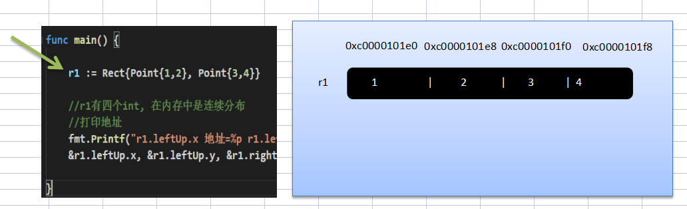

2 ) 结构体是用户单独定义的类型，和其它类型进行转换时需要有完全相同的字段(名字、个数和类型)

```go
package main 
import "fmt"
import "encoding/json"

type A struct {
	Num int
}
type B struct {
	Num int
}

func main() {
	var a A
	var b B
	a = A(b) // 可以转换，但是有要求，就是结构体的的字段要完全一样(包括:名字、个数和类型！)
	fmt.Println(a, b)//{0} {0}
}
```

3 ) 结构体进行type重新定义(相当于取别名)，Golang认为是新的数据类型，但是相互间可以强转

4 ) struct的每个字段上，可以写上一个 **tag** , 该tag可以通过反射机制获取，常见的使用场景就是序列化和反序列化。

- 序列化的使用场景:


```go
package main 
import "fmt"
import "encoding/json"

type Monster struct{
	Name string `json:"name"` // `json:"name"` 就是 struct tag
	Age int `json:"age"`
	Skill string `json:"skill"`
}
func main() {
	//1. 创建一个Monster变量
	monster := Monster{"牛魔王", 500, "芭蕉扇~"}

	//2. 将monster变量序列化为 json格式字串
	//   json.Marshal 函数中使用反射
	jsonStr, err := json.Marshal(monster)
	if err != nil {
		fmt.Println("json 处理错误 ", err)
	}
	fmt.Println("jsonStr", string(jsonStr))//jsonStr {"name":"牛魔王","age":500,"skill":"芭蕉扇~"}
}
```

### 10.5 方法
在某些情况下，我们要需要声明(定义)方法。比如Person结构体:除了有一些字段外( 年龄，姓名…)，Person结构体还有一些行为比如:可以说话、跑步…，通过学习，还可以做算术题。这时就要用方法才能完成。

Golang中的方法是**作用在指定的数据类型**上的(即：和指定的数据类型绑定)，因此**自定义类型，都可以有方法**，而不仅仅是 **struct**


#### 10.5.1 方法的声明与调用

```go
func(recevier type)methodName（参数列表） (返回值列表){
    方法体
    return 返回值
}  

1 ) 参数列表：表示方法输入
2 ) receviertype: 表示这个方法和type这个类型进行绑定，或者说该方法作用于type类型
3 ) receivertype:type可以是结构体，也可以其它的自定义类型
4 ) receiver: 就是type类型的一个变量(实例)，比如 ：Person结构体 的一个变量(实例)
5 ) 返回值列表：表示返回的值，可以多个
6 ) 方法主体：表示为了实现某一功能代码块
7 ) return 语句不是必须的
```

```go
//func( a A )test() {} 表示A结构体有一方法，方法名为 test
//(a A) 体现 test方法是和A类型绑定的
type A struct{
	Numint
}
func(a A)test(){
	fmt.Println(a.Num)
}
```


```go
//1 ) test方法和Person类型绑定
//2 ) test方法只能通过 Person类型的变量来调用，而不能直接调用，也不能使用其它类型变量来调用
//3 ) func(p Person)test(){}  p表示哪个Person变量调用，这个p就是它的副本, 这点和函数传参非常相似。
//4 ) p 这个名字，有程序员指定，不是固定, 比如修改成person也是可以
package main

import (
	"fmt"	
)

type Person struct{
	Name string
}

//给Person类型绑定一方法
func (person Person) test() {
	person.Name = "jack"
	fmt.Println("test() name=", person.Name) // 输出jack
}

func main() {
	var p Person
	p.Name = "tom"
	p.test() //调用方法
	fmt.Println("main() p.Name=", p.Name) //test() name= jack
}
```

#### 10.5.2 方法的调用与传参机制原理

方法的调用和传参机制和函数基本一样，不一样的地方是方法调用时，会将调用方法的变量，当做实参也传递给方法。下面我们举例说明。

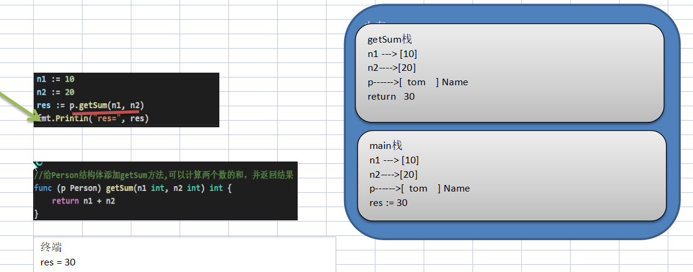

1 ) 在通过一个结构体实例变量去调用方法时，其调用机制和函数一样

2 ) 不一样的地方时，变量调用方法时，该结构体实例变量变量本身也会作为一个参数传递到方法(如果变量是值类型，则进行值拷贝，如果变量是**引用类型，则进行地址拷贝**)

#### 10.5.3 方法使用细节

1 ) 结构体类型是值类型，在方法调用中，遵守值类型的传递机制，是值拷贝传递方式

2 ) 如程序员希望在方法中，修改结构体变量的值，可以通过结构体指针的方式来处理

```go
package main

import (
	"fmt"	
)

type Circle struct {
	radius float64
}

//为了提高效率，通常我们方法和结构体的指针类型绑定
func (c *Circle) area2() float64 {
	//因为 c是指针，因此我们标准的访问其字段的方式是 (*c).radius
	//return 3.14 * (*c).radius * (*c).radius
	// (*c).radius 等价  c.radius 
	fmt.Printf("c 是  *Circle 指向的地址=%p", c)
	c.radius = 10
	return 3.14 * c.radius * c.radius
}
 
func main() {
	//创建一个Circle 变量
	var c Circle 
	fmt.Printf("main c 结构体变量地址 =%p\n", &c)
	c.radius = 7.0
	//res2 := (&c).area2()
	//编译器底层做了优化  (&c).area2() 等价 c.area()
	//因为编译器会自动的给加上 &c
	res2 := c.area2()
	fmt.Println("面积=", res2)
	fmt.Println("c.radius = ", c.radius) //10
}
```

3 ) Golang中的方法作用在指定的数据类型上的(即：和指定的数据类型绑定)，因此自定义类型，都可以有方法，而不仅仅是struct， 比如int,float 32 等都可以有方法

```go
package main

import (
	"fmt"	
)
/*
Golang中的方法作用在指定的数据类型上的(即：和指定的数据类型绑定)，因此自定义类型，
都可以有方法，而不仅仅是struct， 比如int , float32等都可以有方法
*/
type integer int

func (i integer) print() {
	fmt.Println("i=", i)
}
//编写一个方法，可以改变i的值
func (i *integer) change() {
	*i = *i + 1
}

func main() {
	var i integer = 10
	i.print()//10
	i.change()
	fmt.Println("i=", i)//11
}
```

4 ) 方法的访问范围控制的规则，和函数一样。方法名首字母小写，只能在本包访问，方法首字母大写，可以在本包和其它包访问。

5 ) 如果一个类型实现了String()这个方法，那么fmt.Println默认会调用这个变量String()进行输出

```go
package main

import (
	"fmt"	
)
type Student struct {
	Name string
	Age int
}

//给*Student实现方法String()
func (stu *Student) String() string {
	str := fmt.Sprintf("Name=[%v] Age=[%v]", stu.Name, stu.Age)
	return str
}

func main() {
	//定义一个Student变量
	stu := Student{
		Name : "tom",
		Age : 20,
	}
	//如果你实现了 *Student 类型的 String方法，就会自动调用
	fmt.Println(&stu) //Name=[tom] Age=[20]
}
```

#### 10.5.4 方法与函数的区别

1 ) 调用方式不一样

- 函数的调用方式: 函数名(实参列表)
- 方法的调用方式: 变量.方法名(实参列表)

2 ) 对于普通函数，接收者为值类型时，不能将指针类型的数据直接传递，反之亦然

```go
package main

import (
	"fmt"	
)

type Person struct {
	Name string
} 

//对于普通函数，接收者为值类型时，不能将指针类型的数据直接传递，反之亦然
func test01(p Person) {
	fmt.Println(p.Name)
}

func test02(p *Person) {
	fmt.Println(p.Name)
}

func main() {
	p := Person{"tom"}
	test01(p)
	test02(&p)
}
```

3 ) 对于方法（如struct的方法），接收者为值类型时，可以直接用指针类型的变量调用方法，反过来同样也可以

```go
package main

import (
	"fmt"	
)

type Person struct {
	Name string
} 

//对于方法（如struct的方法），
//接收者为值类型时，可以直接用指针类型的变量调用方法，反过来同样也可以
func (p Person) test03() {
	p.Name = "jack"
	fmt.Println("test03() =", p.Name) // jack
}

func (p *Person) test04() {
	p.Name = "mary"
	fmt.Println("test03() =", p.Name) // mary
}

func main() {
	p := Person{"tom"}

	p.test03()
	fmt.Println("main() p.name=", p.Name) // tom
	
	(&p).test03() // 从形式上是传入地址，但是本质仍然是值拷贝
	fmt.Println("main() p.name=", p.Name) // tom

	(&p).test04()
	fmt.Println("main() p.name=", p.Name) // mary
	p.test04() // 等价 (&p).test04 , 从形式上是传入值类型，但是本质仍然是地址拷贝
}
```

1 ) 不管调用形式如何，真正决定是值拷贝还是地址拷贝，看这个**方法是和哪个类型绑定**.

2 ) 如果是和值类型，比如 ( **p Person** ), 则是值拷贝， 如果和指针类型，比如是 ( **p\*Person** ) 则是地址拷贝。


### 10.8 接口

在Golang中 多态 特性主要是通过接口来体现的。

```go
package main
import (
	"fmt"
)

//声明/定义一个接口
type Usb interface {
	//声明了两个没有实现的方法
	Start() 
	Stop()
}

//声明/定义一个接口
type Usb2 interface {
	//声明了两个没有实现的方法
	Start() 
	Stop()
	Test()
}

type Phone struct {
}  
//让Phone 实现 Usb接口的方法
func (p Phone) Start() {
	fmt.Println("手机开始工作。。。")
}
func (p Phone) Stop() {
	fmt.Println("手机停止工作。。。")
}

type Camera struct {
}
//让Camera 实现   Usb接口的方法
func (c Camera) Start() {
	fmt.Println("相机开始工作~~~。。。")
}
func (c Camera) Stop() {
	fmt.Println("相机停止工作。。。")
}

//计算机
type Computer struct {
}

//编写一个方法Working 方法，接收一个Usb接口类型变量
//只要是实现了 Usb接口 （所谓实现Usb接口，就是指实现了 Usb接口声明所有方法）
func (c Computer) Working(usb Usb) {
	//通过usb接口变量来调用Start和Stop方法
	usb.Start()
	usb.Stop()
}

func main() {
	//先创建结构体变量
	computer := Computer{}
	phone := Phone{}
	camera := Camera{}

	//关键点
	computer.Working(phone)
	computer.Working(camera) //
}
//---结果-----
手机开始工作。。。
手机停止工作。。。
相机开始工作~~~。。。
相机停止工作。。。
```

接口概念

interface类型可以定义一组方法，但是这些不需要实现。并且interface不能包含任何变量。到某个 自定义类型(比如结构体Phone)要使用的时候,在根据具体情况把这些方法写出来(实现)。

1 ) 接口里的**所有方法都没有方法体**，即接口的方法都是没有实现的方法。接口体现了程序设计的多态和高内聚低偶合的思想。

2 ) Golang中的接口，**不需要显式的实现**。只要一个变量，含有接口类型中的所有方法，那么这个变量就实现这个接口。因此，Golang中没有`implement`这样的关键字
#### 10.8.1注意事项与细节
1 ) 接口本身不能创建实例,但是可以指向一个实现了该接口的自定义类型的变量(实例)

2 ) 接口中所有的方法都没有方法体,即都是没有实现的方法。

3 ) 在Golang中，一个自定义类型需要将某个接口的所有方法都实现，我们说这个自定义类型实现 了该接口。

4 ) 一个自定义类型只有实现了某个接口，才能将该自定义类型的实例(变量)赋给接口类型

5 ) 只要是自定义数据类型，就可以实现接口，不仅仅是结构体类型。

6 ) 一个自定义类型可以实现多个接口

```go
package main
import (
	"fmt"
)

type AInterface interface {
	Say()
}

type BInterface interface {
	Hello()
}

type Monster struct {
}
func (m Monster) Hello() {
	fmt.Println("Monster Hello()~~")
}
func (m Monster) Say() {
	fmt.Println("Monster Say()~~")
}

func main() {
	//Monster实现了AInterface 和 BInterface
	var monster Monster
	var a2 AInterface = monster
	var b2 BInterface = monster
	a2.Say() //Monster Say()~~
	b2.Hello()  //Monster Hello()~~
}
```

7 ) Golang接口中不能有任何变量

```go
type AInterface interface {
	//Name string //错误
	Say()
}
```

8 ) 一个接口(比如A接口)可以继承多个别的接口(比如B，C接口)，这时如果要实现A接口，也必须将B,C接口的方法也全部实现。

```go
package main
import (
	"fmt"
)

type BInterface interface {
	test01()
}

type CInterface interface {
	test02()
}

type AInterface interface {
	BInterface
	CInterface
	test03()
}

//如果需要实现AInterface,就需要将BInterface CInterface的方法都实现
type Stu struct {
}
func (stu Stu) test01() {
}
func (stu Stu) test02() {
}
func (stu Stu) test03() {	
}

type T  interface{
}

func main() {
	var stu Stu
	var a AInterface = stu
	a.test01()
}
```

10 ) 空接口interface{}没有任何方法，所以所有类型都实现了空接口, 即我们可以把任何一个变量赋给空接口。

```go
package main
import (
	"fmt"
)

type BInterface interface {
	test01()
}

type CInterface interface {
	test02()
}

type AInterface interface {
	BInterface
	CInterface
	test03()
}

//如果需要实现AInterface,就需要将BInterface CInterface的方法都实现
type Stu struct {
}
func (stu Stu) test01() {

}
func (stu Stu) test02() {
	
}
func (stu Stu) test03() {
	
}

type T  interface{

}

func main() {
    var stu Stu
	var a AInterface = stu
	a.test01()
    
	var t T = stu //ok
	fmt.Println(t)//{}
	var t2 interface{}  = stu
	var num1 float64 = 8.8
	t2 = num1
	t = num1
	fmt.Println(t2, t)//8.8 8.8
}
```

### 10.9 接口与继承的区别

```go
package main
import (
	"fmt"
)

//Monkey结构体
type Monkey struct {
	Name string
}

//声明接口
type BirdAble interface {
	Flying()
}

type FishAble interface {
	Swimming()
}

func (this *Monkey) climbing() {
	fmt.Println(this.Name, " 生来会爬树..")
}

//LittleMonkey结构体
type LittleMonkey struct {
	Monkey //继承
}


//让LittleMonkey实现BirdAble
func (this *LittleMonkey) Flying() {
	fmt.Println(this.Name, " 通过学习，会飞翔...")
}

//让LittleMonkey实现FishAble
func (this *LittleMonkey) Swimming() {
	fmt.Println(this.Name, " 通过学习，会游泳..")
}

func main() {
	//创建一个LittleMonkey 实例
	monkey := LittleMonkey{
		Monkey {
			Name : "悟空",
		},
	}
	monkey.climbing()//悟空  生来会爬树..
	monkey.Flying()//悟空  通过学习，会飞翔...
	monkey.Swimming()//悟空  通过学习，会游泳..
}
```

1 ) 当A结构体继承了B结构体，那么A结构就自动的继承了B结构体的字段和方法，并且可以直接使用

2 ) 当A结构体需要扩展功能，同时不希望去破坏继承关系，则可以去实现某个接口即可，因此我们可以认为：实现接口是对继承机制的补充.

- 实现接口可以看作是对 继承的一种补充

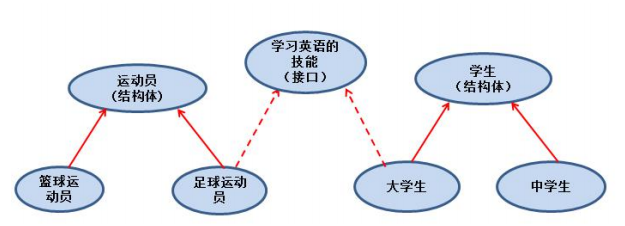

- 接口和继承解决的解决的问题不同

继承的价值主要在于：解决代码的复用性和可维护性。

接口的价值主要在于：设计，设计好各种规范(方法)，让其它自定义类型去实现这些方法。

- 接口比继承更加灵活 Person Student BirdAbleLittleMonkey

接口比继承更加灵活，继承是满足 is-a的关系，而接口只需满足 like-a的关系。

- 接口在一定程度上实现代码解耦

## 十一、文件操作


## 十二、单元测试


## 十三、goroutine和channel

### 13.1 goroutine线程-基本介绍

- 进程就是程序在操作系统中的一次执行过程，是系统进行资源分配和调度的基本单位
- 线程是进程的一个执行实例，是程序执行的最小单元，它是比进程更小的能独立运行的基本单位
- 一个进程可以创建销毁多个线程，同一个进程中的多个线程可以并发执行
- 一个程序至少一个进程，一个进程至少一个线程

- 并发和并行

1 ) 多线程程序在单核上运行，就是并发

2 ) 多线程程序在多核上运行，就是并行


**并发**：因为是在一个cpu上，比如有10个线程，每个线程执行10毫秒（进行轮询操作），从人的角度看，好像这10个线程都在运行，但是从微观上看，在某一个时间点看，其实只有一个线程在执行，这就是并发。

**并行**：因为是在多个cpu上（比如有10个cpu），比如有10个线程，每个线程执行10毫秒（各自在不同cpu上执行），从人的角度看，这10个线程都在运行，但是从微观上看，在某一个时间点看，也同时有10个线程在执行，这就是并行。

### 13.2 Go协程和Go主线程
Go主线程(有程序员直接称为线程/也可以理解成进程): 一个Go线程上，可以起多个协程，你可以这样理解，协程是轻量级的线程[编译器做优化]。

Go协程的特点:

- 有独立的栈空间
- 共享程序堆空间
- 调度由用户控制
- 协程是轻量级的线程

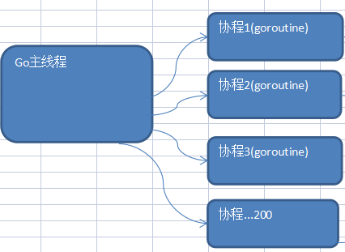


```go
package main
import (
   "fmt"
   "strconv"
   "time"
)

// 在主线程(可以理解成进程)中，开启一个goroutine, 该协程每隔1秒输出 "hello,world"
// 在主线程中也每隔一秒输出"hello,golang", 输出10次后，退出程序
// 要求主线程和goroutine同时执行

//编写一个函数，每隔1秒输出 "hello,world"
func test() {
   for i := 1; i <= 10; i++ {
       //strconv.Itoa将数字转换成对应的字符串类型的数字
      fmt.Println("test () hello,world " + strconv.Itoa(i))//test () hello,world 1
      time.Sleep(time.Second)
   }
}

func main() {

   go test() // 开启了一个协程

   for i := 1; i <= 10; i++ {
      fmt.Println(" main() hello,golang" + strconv.Itoa(i))
      time.Sleep(time.Second) //main() hello,golang1
   }
}
```

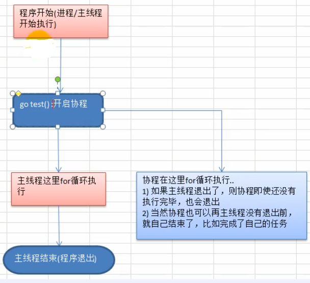

**协程特点**
1 ) 主线程是一个物理线程，直接作用在cpu上的。是重量级的，非常耗费cpu资源。

2 ) 协程从主线程开启的，是轻量级的线程，是逻辑态。对资源消耗相对小。

3 ) Golang的协程机制是重要的特点，可以轻松的开启上万个协程。其它编程语言的并发机制是一般基于线程的，开启过多的线程，资源耗费大，这里就突显Golang在并发上的优势了

### 13.3 MPG模式基本介绍


- M:操作系统的主线程（是物理线程）
- P:协程执行需要的上下文
- G：协程

#### 13.3.1 MPG模式运行的状态 1

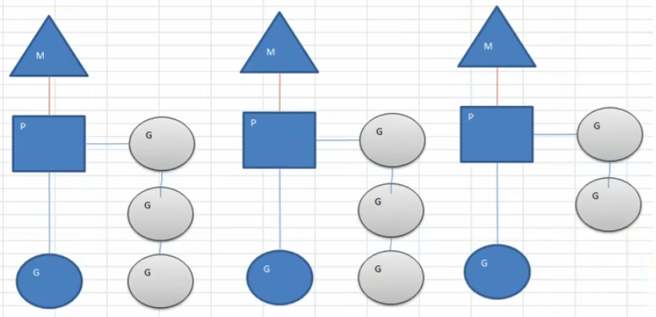

- 当前程序有三个M，如果三个M都在一个cpu运行，就是并发，如果在不同的cpu运行就是并行
- M1，M2，M3正在执行一个G，M1的协程队列有三个，M2的协程队列有3个，M3协程队列有2个
- 从上图可以看到:Go的协程是轻量级的线程，是逻辑态的，Go可以容易的起上万个协程。
- 其他程序c/java的多线程，往往是内核态的，比较重量级，几千个线程可能耗光cpu
  

#### 13.3.2 MPG模式运行的状态 2

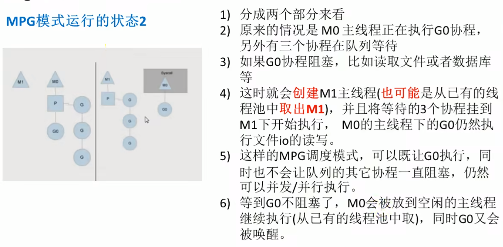

- 设置GOLANG运行的CPU数
- 为了充分了利用多cpu的优势，在Golang程序中，设置运行的cpu数目

```go
package main
import (
	"runtime"
	"fmt"
)

func main() {
	cpuNum := runtime.NumCPU()
	fmt.Println("cpuNum=", cpuNum)

	//可以自己设置使用多个cpu
	runtime.GOMAXPROCS(cpuNum - 1)
	fmt.Println("ok")
}
```

- **go1.8后，默认让程序运行在多个核上，可以不用设置了**
- go1.8前，还是要设置以下，可以更高效的利用cpu

## 十四、反射


## 十五、TCP编程


## 参考

[](https://blog.csdn.net/zhaicheng55/article/details/127978156)
